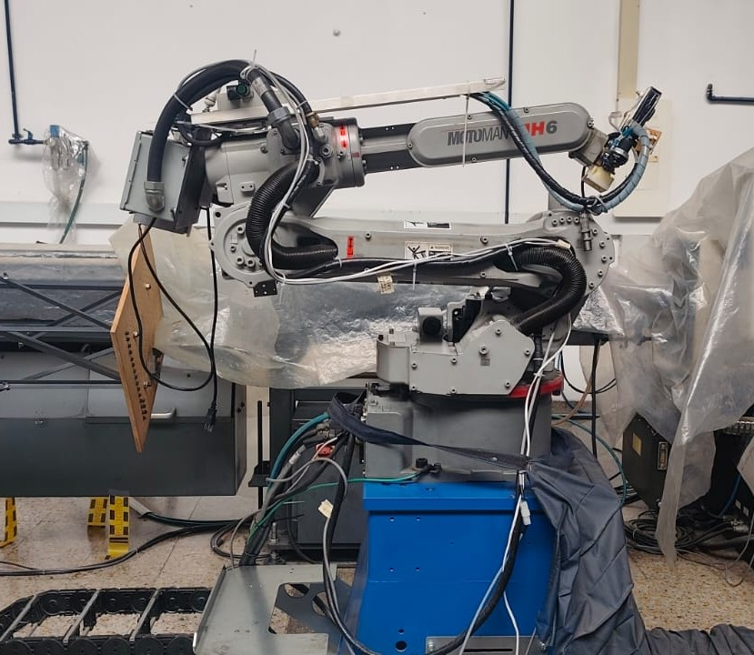
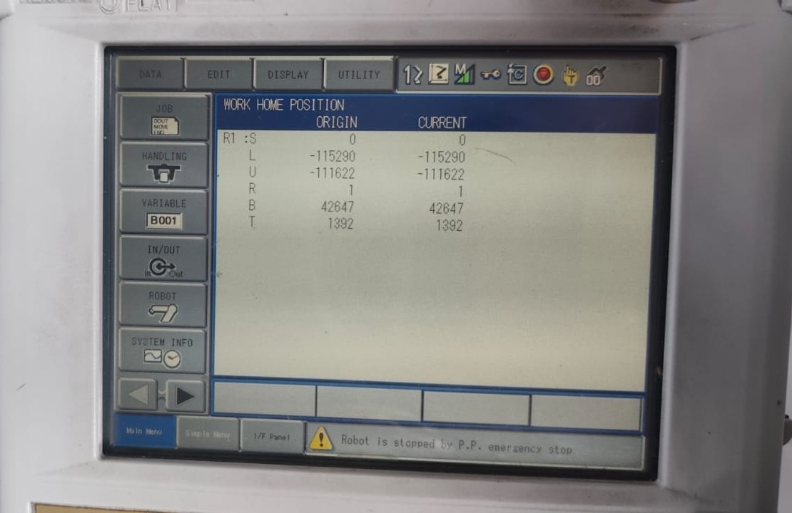
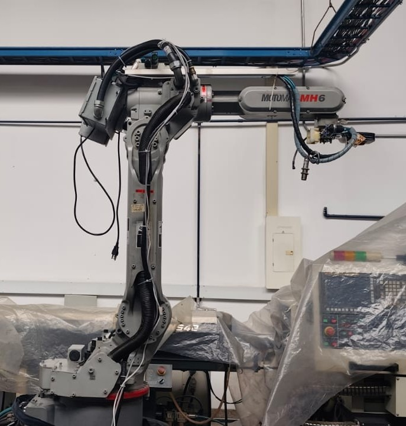
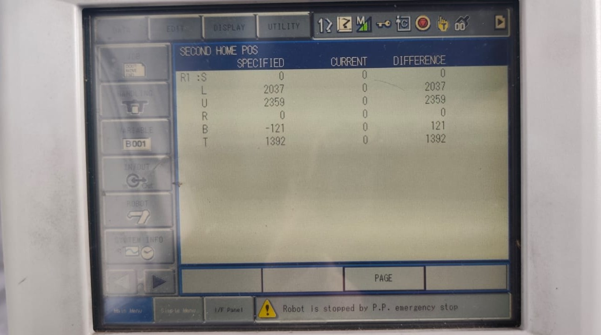
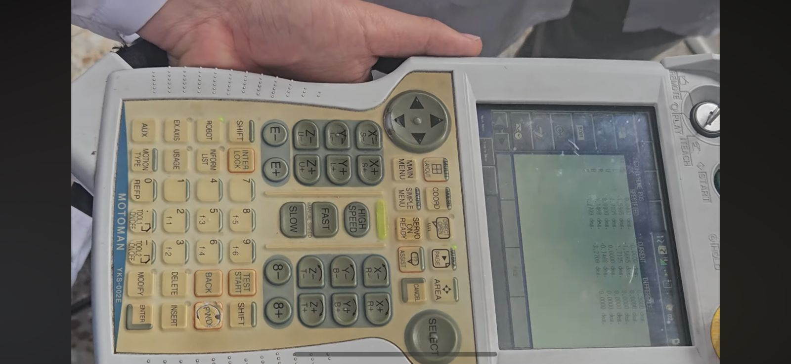
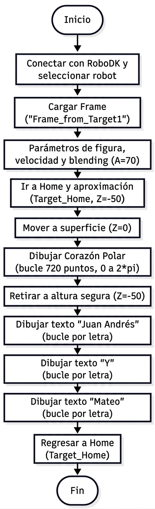
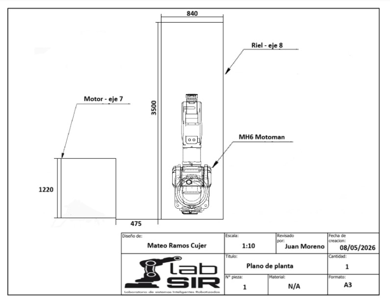
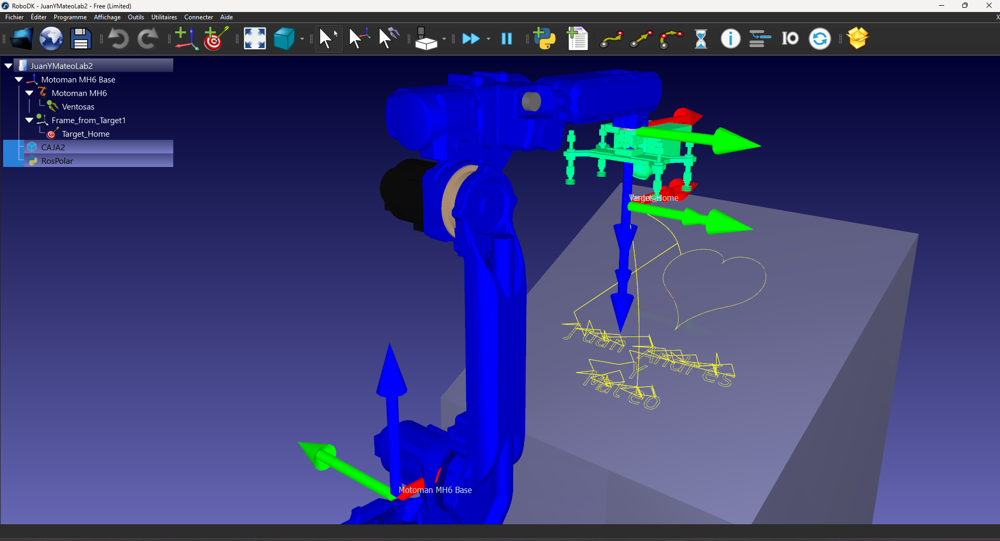
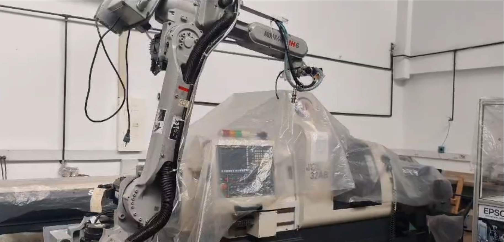

<div align="center">
<picture>
    <source srcset="https://imgur.com/5bYAzsb.png" media="(prefers-color-scheme: dark)">
    <source srcset="https://imgur.com/Os03JoE.png" media="(prefers-color-scheme: light)">
    
</picture>

<h3>Curso de Robótica 2026-I</h3>

<h1>Informe Laboratorio # 2</h1>

<h2>Profesores: <br>Pedro Fabián Cárdenas Herrera <br> Manuel Felipe Carranza Montenegro<br></h2>

</div>

# Integrantes
1. Juan Andrés Moreno Benavides [jumorenobe@unal.co](Jumorenobe)
2. Mateo Ramos Cujer [mramoscu@unal.edu.co](MateoKGR)

# Indice
1. [Cuadro comparativo](#Cuadro-Comparativo)
2. [Descripción de las configuraciones Home 1 y Home 2](#Descripción-de-las-configuraciones-Home-1-y-Home-2)
3. [Procedimiento detallado](#Procedimiento-Detallado)
4. [Explicación Completa](#Explicación-Completa)
5. [Descripción funcionalidades RoboDK](#Descripción-funcionalidades-RoboDK)
6. [Análisis comparativo RoboDK y RobotStudio](#Análisis-comparativo-RoboDK-y-RobotStudio)
7. [Diagrama de flujo Codigo de trabajoo](#Diagrama-de-flujo-Codigo-de-trabajo)
8. [Plano de Planta](#Plano-de-Planta)
9. [Código Final](#Código-Final)
10. [Simulación](#Simulación)
11. [Implementación](#Implementación)
12. [Conclusiones y Trabajo Futuro](#Conclusiones-y-Trabajo-Futuro)
    
## Cuadro Comparativo

| Característica | **Motoman MH6 (Yaskawa)** | **ABB IRB140** |
|----------------|----------------------------|----------------|
| **Fabricante** | Yaskawa Motoman | ABB Robotics |
| **Grados de libertad (DOF)** | 6 | 6 |
| **Capacidad de carga máxima (Payload)** | 6 kg | 6 kg |
| **Alcance máximo** | 1,371 mm | 810 mm |
| **Repetibilidad (Precisión de posicionamiento)** | ±0.08 mm | ±0.03 mm |
| **Peso del manipulador** | 130 kg | 98 kg |
| **Rango de movimiento (articulaciones)** | S: ±170°, L: +155°/-90°, U: +250°/-175°, R: ±200°, B: ±150°, T: ±360° | J1: ±160°, J2: +110°/-110°, J3: +230°/-60°, J4: ±200°, J5: ±115°, J6: ±400° |
| **Velocidad máxima conjunta (aprox.)** | Hasta 230°/s (dependiendo del eje) | Hasta 320°/s (dependiendo del eje) |
| **Montaje** | Piso, pared, techo o invertido | Piso, pared, techo o invertido |
| **Controlador** | DX100 / DX200 | IRC5 Compact |
| **Aplicaciones típicas** | Manipulación de materiales, soldadura por arco, paletizado, ensamblaje, corte | Ensamblaje, manipulación de materiales, atornillado, laboratorio, empaquetado |
| **Tipo de energía** | Eléctrico (servomotores AC) | Eléctrico (servomotores AC) |
| **Comunicación con software** | Compatible con RoboDK, MotoSim, MotoCom | Compatible con RobotStudio |
| **Ambiente operativo** | 0–45°C, IP54 (IP67 opcional en muñeca) | 0–45°C, IP54 (IP67 en muñeca opcional) |
| **Ventajas destacadas** | Mayor alcance, buena relación peso/rango, versátil en montaje | Alta precisión, tamaño compacto, excelente para tareas de laboratorio |
| **Limitaciones** | Menor precisión que el IRB140 | Menor alcance y carga útil limitada a 6 kg |
| **Año de introducción** | ~2005 | ~2004 |


## Descripción de las configuraciones Home 1 y Home 2

El manipulador Motoman MH6 cuenta con dos configuraciones iniciales principales: Home 1 y Home 2.

<p align="center">
  <b>
    Home 1
  </b><br>
</p>

En la configuración Home 1, La pantalla "Work Home Position" define la ubicación de referencia operativa del robot dentro de su entorno de trabajo. Se utiliza para establecer un punto de partida seguro en la ejecución de programas (Jobs) y permite que el controlador confirme, mediante señales de salida, que el manipulador se encuentra fuera de la zona de peligro o en posición de reposo corresponde a una posición más compacta o “recogida”, donde el robot mantiene sus articulaciones cercanas al cuerpo. Esta posición es más segura para el almacenamiento o reposo, ya que reduce el espacio ocupado y minimiza el riesgo de colisiones.

<p align="center">
  
</p>

<p align="center">
  
</p>

<p align="center">
  <b>
    Home 2
  </b><br>
</p>

Por otro lado, en la configuración Home 2 los ejes del robot están extendidos en una posición más abierta, lo que facilita el inicio de operaciones y la ejecución de trayectorias, ya que el robot tiene un rango de movimiento amplio y puede acceder fácilmente a su zona de trabajo, Se utiliza la mayoria de las veces para fines de mantenimiento y sincronización mecánica. Representa la posición absoluta de calibración del manipulador. La columna 'Difference' es vital, ya que permite al técnico verificar si existe una desviación entre la posición electrónica de los encoders y la posición mecánica real de los ejes del robot ademas de contar con 6 muescas fisicas que coinciden con su posición en home 2 para temas de calibración y que los encondes se encuentren en cero.

<p align="center">
  
</p>

<p align="center">
  
</p>

En conclusión, la posición Home 2 es más adecuada para iniciar tareas, mientras que Home 1 se recomienda para finalizar el trabajo,dejar el robot en reposo o calibrarlo.

## Procedimiento Detallado

Antes de realizar cualquier movimiento, es importante tener en cuenta los siguientes pasos de seguridad y configuración:

Primero, se debe **desactivar el botón de seguridad o parada de emergencia**. Luego, es necesario **activar los servomotores** presionando el botón **“SERVO ON READY”**.  
Además, el **teach pendant** debe estar en modo **“TEACH”**, el cual permite realizar trayectorias manuales.
Posteriormente, se debe presionar el botón **“COORD”**, que permite alternar entre el modo de movimiento **articular** o **lineal**.  
Si se selecciona el modo **articular**, en la parte superior de la pantalla aparecerá un símbolo de un robot.  
En cambio, si se selecciona el modo **lineal**, se mostrará un sistema de coordenadas.

Una vez definido el modo de movimiento, se pueden realizar desplazamientos utilizando los botones correspondientes a los ejes **X**, **Y** y **Z**.  
Es importante tener en cuenta que las **articulaciones 7 y 8** son independientes de estas formas de movimiento del robot.

## Explicación Completa

El manipulador Motoman MH6 cuenta con tres niveles de velocidad para los movimientos manuales: Slow, Fast y High Speed. Estos niveles determinan la rapidez con la que se desplazan las articulaciones o el efector final cuando se controla el robot desde el teach pendant.

El operador puede cambiar entre los tres modos directamente desde el panel de control, usando el botón correspondiente al nivel deseado. Cada vez que se selecciona un modo, el cambio se aplica de inmediato y se refleja en la pantalla del controlador, donde aparece indicado el nivel de velocidad activo.

En general, el modo Slow se utiliza para realizar movimientos precisos o cercanos a zonas de trabajo sensibles; Fast es útil para desplazamientos intermedios o ajustes rápidos; y High Speed se reserva para movimientos amplios o pruebas en zonas despejadas.

Este sistema de tres velocidades facilita el control del robot de forma segura y práctica, permitiendo al operador ajustar la rapidez según la tarea sin necesidad de configuraciones adicionales.

<p align="center">
  
</p>


## Descripción funcionalidades RoboDK
RoboDK es una plataforma de simulación y programación *offline* de robots industriales que permite desarrollar, probar y optimizar trayectorias sin necesidad de utilizar el robot físico.  

### Funcionalidades Principales

- **Simulación de trayectorias:** permite crear y visualizar movimientos del robot en un entorno 3D, evaluando posibles colisiones y alcances.  
- **Programación offline:** se pueden generar programas compatibles con múltiples marcas de robots (como KUKA, ABB, Fanuc o UR) directamente desde la interfaz.  
- **Integración CAD/CAM:** facilita importar modelos CAD para realizar trayectorias de mecanizado, soldadura o pulido.  
- **Control y comunicación:** soporta conexión en tiempo real con el robot físico mediante protocolos estándar.  
- **Personalización mediante scripts:** admite el uso de Python para automatizar rutinas y definir trayectorias paramétricas.  

RoboDK puede comunicarse con el manipulador de dos maneras:

1. **Programación offline:**  
   En este modo, RoboDK genera el código del programa compatible con el lenguaje del fabricante del robot (por ejemplo: KUKA, ABB, Fanuc, UR, Mitsubishi, entre otros).  
   Este archivo se transfiere manualmente al controlador del robot, donde se ejecuta sin necesidad de mantener una conexión activa con el software.

2. **Control online (en tiempo real):**  
   RoboDK puede establecer una conexión directa con el robot físico mediante una red Ethernet,WIFI o protocolo TCP/IP.  
   A través de esta comunicación, el software envía las instrucciones al controlador para mover el robot en tiempo real.  
   Para ello, utiliza **drivers específicos** para cada marca de robot, permitiendo enviar comandos, actualizar posiciones y ejecutar programas desde la interfaz de RoboDK o mediante scripts en Python.

En ambos casos, RoboDK actúa como un intermediario entre el entorno virtual de simulación y el controlador físico del robot, garantizando que los movimientos sean precisos, seguros y reproducibles.

## Análisis comparativo RoboDK y RobotStudio

RoboDK se caracteriza por ser un software multimarca, compatible con una gran cantidad de robots industriales como Yaskawa,ABB, FANUC, Universal Robots, entre otros. Esto hace que sea muy versátil, especialmente en entornos académicos o de investigación donde se utilizan equipos de distintos fabricantes. Además, permite generar y editar programas en varios lenguajes (como Python, RAPID o Motoman INFORM) y cuenta con una interfaz bastante intuitiva y ligera. Su conexión con el robot físico se realiza a través de drivers o protocolos TCP/IP específicos de cada marca, como el DX100 o DX200 en el caso del Motoman MH6.

Por otro lado, RobotStudio es una herramienta desarrollada por ABB exclusivamente para sus propios robots. Está enfocada en la simulación, programación y prueba de rutinas en lenguaje RAPID. Su entorno es más técnico, es más ideal para entornos industriales donde se necesita validar trayectorias, detectar colisiones y optimizar ciclos antes de llevarlos a la planta.

En términos generales, RoboDK ofrece más flexibilidad y compatibilidad, RobotStudio proporciona mas realismo y precisió pero solo para robots ABB. Para trabajos educativos y proyectos con diferentes marcas, RoboDK resulta más práctico; en cambio, para validaciones industriales específicas con robots ABB, RobotStudio es mejor.

## Diagrama de flujo Codigo de trabajo
Se adjunta el diagrama de flujo del codigo final del script de Python 

<p align="center">
  
</p>

## Plano de Planta 

<p align="center">
  
</p>

## Código Final

Este programa en Python utiliza la API de RoboDK para controlar el robot industrial manipulador Motoman MH6. Establece la conexión con el robot, configura su marco de trabajo y genera movimientos que dibujan una figura con cordenadas polares en forma semejante a un corazón ademas de escribir el nombre de los 2 integrantes del grupo Juan Andrés y Mateo. Combina cálculos matemáticos con la función de cordenadas polares con con comandos de movimientos dados por la libreria matplotlib para ejecutar trayectorias precisas dentro del entorno de simulación que dibujen la figura y el texto.

```python
from robodk.robolink import *    # API para comunicarte con RoboDK
from robodk.robomath import *    # Funciones matemáticas
import math
from matplotlib.textpath import TextPath
from matplotlib.path import Path

#------------------------------------------------
# 1) Conexión a RoboDK e inicialización
#------------------------------------------------
RDK = Robolink()

# Elegir un robot (si hay varios, aparece un popup)
robot = RDK.ItemUserPick("Selecciona un robot", ITEM_TYPE_ROBOT)
if not robot.Valid():
    raise Exception("No se ha seleccionado un robot válido.")

# Conectar al robot físico
#if not robot.Connect():
    #raise Exception("No se pudo conectar al robot. Verifica que esté en modo remoto y que la configuración sea correcta.")

# Confirmar conexión
#if not robot.ConnectedState():
   # raise Exception("El robot no está conectado correctamente. Revisa la conexión.")

#print("Robot conectado correctamente.")

#------------------------------------------------
# 2) Cargar el Frame (ya existente) donde quieres dibujar
#    Ajusta el nombre si tu Frame se llama diferente
#------------------------------------------------
frame_name = "Frame_from_Target1"
frame = RDK.Item(frame_name, ITEM_TYPE_FRAME)
if not frame.Valid():
    raise Exception(f'No se encontró el Frame "{frame_name}" en la estación.')

# Asignamos este frame al robot
robot.setPoseFrame(frame)
# Usamos la herramienta activa
robot.setPoseTool(robot.PoseTool())

# Ajustes de velocidad y blending
robot.setSpeed(300)   # mm/s - Ajusta según necesites
robot.setRounding(5)  # blending (radio de curvatura)

#------------------------------------------------
# 3) Parámetros de la figura (rosa polar)
#------------------------------------------------
num_points = 720       # Cuántos puntos muestreamos (mayor = más suave)
A = 70               # Amplitud (Tamaño Del corazon)
z_surface = 0          # Z=0 en el plano del frame
z_safe = -50            # Altura segura para aproximarse y salir

#------------------------------------------------
# 4) Movimiento al centro en altura segura
#------------------------------------------------
# 4) Movimiento a Home

home_target = RDK.Item("Target_Home", ITEM_TYPE_TARGET)
robot.MoveJ(home_target)
# El centro inicio del corazon corresponde a x=500, y=se calcula con el punto inicial del corazon
theta = 0
r = A * ((math.sin(theta) * (math.sqrt(abs(math.cos(theta))) / (math.sin(theta) + 1.4))) - 2 * math.sin(theta) + 2)

robot.MoveJ(transl(500,-r , z_surface + z_safe))

# Bajamos a la "superficie" (Z=0)
robot.MoveL(transl(500, -r, z_surface))

#------------------------------------------------
# 5) Dibujar El Corazon
#    r = A * ((math.sin(theta) * (math.sqrt(abs(math.cos(theta))) / (math.sin(theta) + 1.4))) - 2 * math.sin(theta) + 2)
#    xbase = r * math.cos(theta)
#    ybase = r * math.sin(theta)
#    x = ybase+300
#    y = -xbase
#------------------------------------------------
# Recorremos theta de 0 a 2*pi (una vuelta completa)

full_turn = 2*math.pi


for i in range(num_points+1):
    print(i)
    # Fracción entre 0 y 1
    t = i / num_points
    # Ángulo actual
    theta = full_turn * t

    # Calculamos r
    r = A * ((math.sin(theta) * (math.sqrt(abs(math.cos(theta))) / (math.sin(theta) + 1.4))) - 2 * math.sin(theta) + 2)

    # Convertimos a coordenadas Cartesianas X, Y
    xbase = r * math.cos(theta)
    ybase = r * math.sin(theta)

    x = ybase+500
    y = -xbase

    # Movemos linealmente (MoveL) en el plano del Frame
    robot.MoveL(transl(x, y, z_surface))

# Al terminar, subimos de nuevo para no chocar
robot.MoveL(transl(x, y, z_surface + z_safe))

#Nombres de los integrantes (50) de altura


text = "Juan Andrés"
scale = 1.5             # escalado (para probar tamaños)
letter_spacing = 50       # separación entre letras en X (en el frame del objeto es y positivo)
text_offset_x = -300       # donde empieza el texto en X (en el frame del objeto es y positivo)
text_offset_y = 90 # debajo del corazon en Y (en el frame del objeto es x positivo)

x_cursor = text_offset_x  # cursor que avanza en X por cada letra

for char in text:
    tp = TextPath((0, 0), char, size=50)
    verts = tp.vertices * scale
    codes = tp.codes

    last_x, last_y = None, None

    for (vx, vy), code in zip(verts, codes):
        x_pos = x_cursor + vx
        y_pos = text_offset_y + vy

        if code == Path.MOVETO:
            robot.MoveL(transl(y_pos, x_pos, z_safe))
            robot.MoveL(transl(y_pos, x_pos, z_surface))
        elif code in (Path.LINETO, Path.CURVE3, Path.CURVE4):
            robot.MoveL(transl(y_pos, x_pos, z_surface))

        # Actualiza última posición
        last_x, last_y = x_pos, y_pos

    # Al terminar la letra, solo levanta en el mismo sitio
    if last_x is not None and last_y is not None:
        robot.MoveL(transl(last_y, last_x, z_safe))

    # Avanza cursor para la siguiente letra
    x_cursor += letter_spacing
# Y
text2 = "Y"
x_cursor = -50     # reinicia el cursor horizontal
text_offset_y -= 70  # baja el texto

for char in text2:
    tp = TextPath((0, 0), char, size=50)
    verts = tp.vertices * scale
    codes = tp.codes

    last_x, last_y = None, None

    for (vx, vy), code in zip(verts, codes):
        x_pos = x_cursor + vx
        y_pos = text_offset_y + vy

        if code == Path.MOVETO:
            robot.MoveL(transl(y_pos, x_pos, z_safe))
            robot.MoveL(transl(y_pos, x_pos, z_surface))
        elif code in (Path.LINETO, Path.CURVE3, Path.CURVE4):
            robot.MoveL(transl(y_pos, x_pos, z_surface))

        last_x, last_y = x_pos, y_pos

    # Levantar pluma al terminar la letra
    if last_x is not None and last_y is not None:
        robot.MoveL(transl(last_y, last_x, z_safe))

    # Avanzar cursor para la siguiente letra
    x_cursor += letter_spacing

# segundo nombre
text2 = "Mateo"
x_cursor = -150      # reinicia el cursor horizontal
text_offset_y -= 70  # baja el texto

for char in text2:
    tp = TextPath((0, 0), char, size=50)
    verts = tp.vertices * scale
    codes = tp.codes

    last_x, last_y = None, None

    for (vx, vy), code in zip(verts, codes):
        x_pos = x_cursor + vx
        y_pos = text_offset_y + vy

        if code == Path.MOVETO:
            robot.MoveL(transl(y_pos, x_pos, z_safe))
            robot.MoveL(transl(y_pos, x_pos, z_surface))
        elif code in (Path.LINETO, Path.CURVE3, Path.CURVE4):
            robot.MoveL(transl(y_pos, x_pos, z_surface))

        last_x, last_y = x_pos, y_pos

    # Levantar pluma al terminar la letra
    if last_x is not None and last_y is not None:
        robot.MoveL(transl(last_y, last_x, z_safe))

    # Avanzar cursor para la siguiente letra
    x_cursor += letter_spacing

robot.MoveJ(home_target)

print(f"¡Figura De Corazon completada en el frame '{frame_name}'!")
```

## Simulación

Por último se presenta el video final de la simulación completa en RoboDK  :

Hacer click en la imagen para ver el video 

<p align="center">
  <b>
    Video de Simulación Final
      
  </b><br>
</p>

<p align="center">
  <a href="https://drive.google.com/file/d/1ij6B6W8OuVKBep31pgdqVkJPGnhWZAq1/view?usp=sharing">
    
  </a>
</p>

## Implementación

Por último se presenta el video final de la implementación completa :

Hacer click en la imagen para ver el video 

<p align="center">
  <b>
    Video de implementación Final
      
  </b><br>
</p>

<p align="center">
  <a href="https://drive.google.com/file/d/1xw-iRde50_FzMe3LMQadTo-4XnVnvb4v/view?usp=sharing"> 
    
  </a>
</p>

## Conclusiones y Trabajo Futuro

La realización de esta práctica permitió validar la eficiencia de la programación offline mediante la API de RoboDK y Python, demostrando que la integración de funciones matemáticas y librerías de diseño facilita la creación de trayectorias complejas, como el corazón y el textocon nuestros nombres, que serían sumamente difíciles de programar de forma manual. Se comprendió que el éxito de la implementación física radica en la rigurosa calibración del Frame de trabajo y en la correcta gestión de las alturas de seguridad para evitar colisiones. Asimismo, se clarificó la importancia operativa de las dos configuraciones Home del Motoman MH6.

En cuanto al análisis comparativo, se concluye que mientras el ecosistema de ABB (RobotStudio) ofrece una precisión técnica superior y un entorno de simulación nativo para sus equipos, RoboDK destaca por su versatilidad multimarca, permitiendo que un mismo script de Python controle tanto al Motoman MH6 como a otros manipuladores con mínimos ajustes. Esta flexibilidad es fundamental en entornos de investigación donde coexisten diferentes fabricantes. Como trabajo futuro, se propone la optimización dinámica de la velocidad según la curvatura de la trayectoria para mejorar la definición del trazo y la integración de sistemas de visión artificial para la detección automática de superficies, eliminando la necesidad de definir manualmente el plano de trabajo en el controlador.


