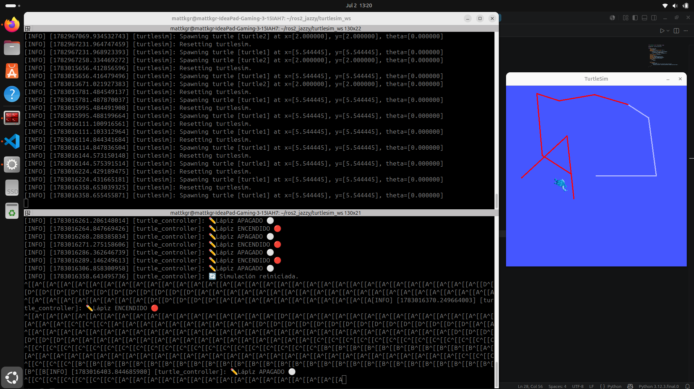
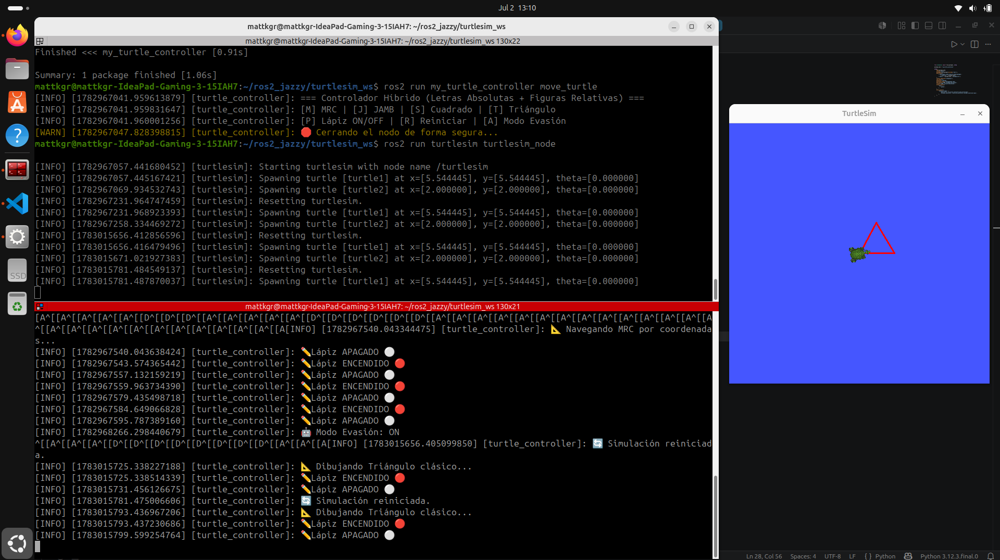
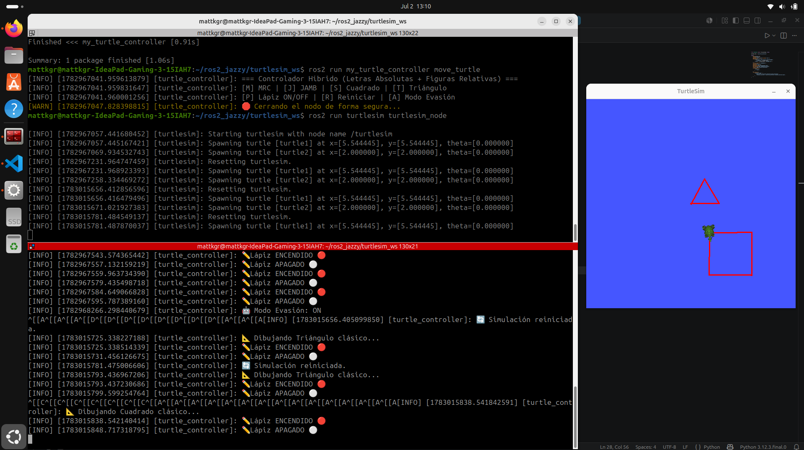
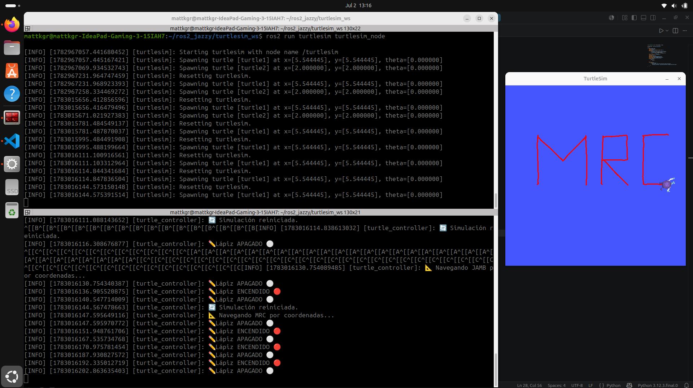
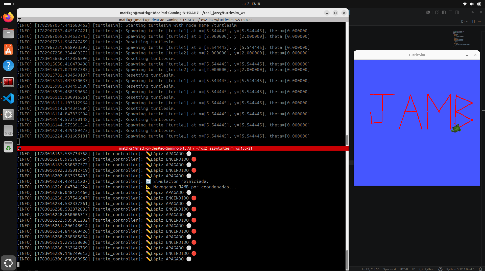
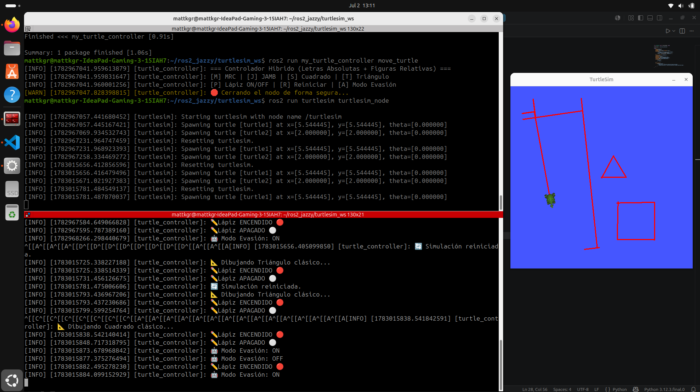
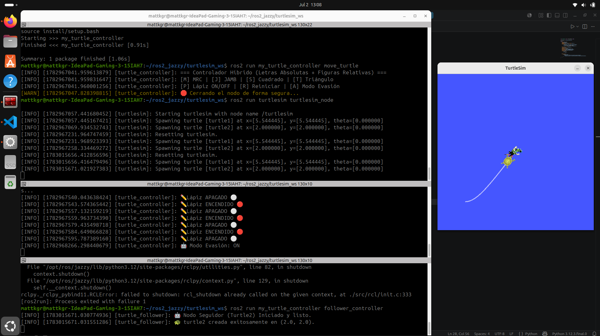
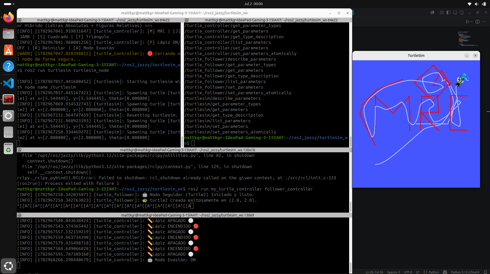
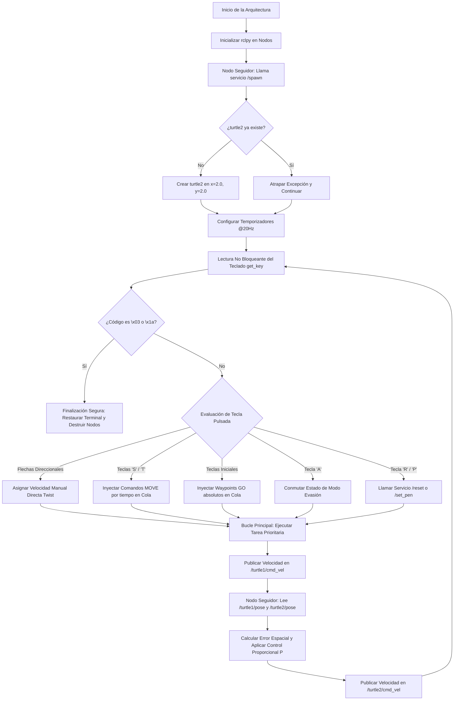

<div align="center">
<picture>
    <source srcset="https://imgur.com/5bYAzsb.png" media="(prefers-color-scheme: dark)">
    <source srcset="https://imgur.com/Os03JoE.png" media="(prefers-color-scheme: light)">
    
</picture>

<h3>Curso de Robótica 2026-I</h3>

<h1>Informe Laboratorio #4</h1>

<h2>Profesores: <br>Pedro Fabián Cárdenas Herrera <br> Manuel Felipe Carranza Montenegro<br></h2>

</div>

# Integrantes
1. Juan Andrés Moreno Benavides [jumorenobe@unal.co](Jumorenobe)
2. Mateo Ramos Cujer [mramoscu@unal.edu.co](MateoKGR)

# Índice

- [1. Descripción General](#1-descripción-general)
- [2. Arquitectura de ROS 2 (Nodos, Tópicos y Servicios)](#2-arquitectura-de-ros-2-nodos-tópicos-y-servicios)
- [3. Control Manual de la Tortuga)](#3-control-manual-de-la-tortuga)
- [4. Funciones Automáticas y Trazado de Iniciales](#4-funciones-automáticas-y-trazado-de-iniciales)
- [5. Sistema Líder-Seguidor](#5-sistema-líder-seguidor)
- [6. Diagrama de Flujo del Sistema](#6-diagrama-de-flujo-del-sistema)
- [7. Video Explicativo con Evidencias de Funcionamiento](#7-video-explicativo-con-evidencias-de-funcionamiento)
- [8. Conclusiones](#9-video-explicativo-y-conclusiones)

---

## 1. Descripción General

Este laboratorio práctico consiste en el diseño, desarrollo e implementación de un sistema de control robótico multiagente utilizando **ROS 2 Jazzy Jalisco** sobre el sistema operativo **Ubuntu 24.04 LTS**. El proyecto explora los fundamentos de la comunicación distribuida en robótica mediante el simulador bidimensional `turtlesim`.

El núcleo del desarrollo se divide en tres hitos principales:
* **Teleoperación de bajo nivel:** Creación de un sistema de lectura directa del teclado en bruto (*raw mode*) sin depender de herramientas estándar como `turtle_teleop_key`, garantizando un control asíncrono y libre de bloqueos.
* **Control cinemático y navegación por puntos (Waypoints):** Implementación de una estrategia híbrida que combina el control por tiempo para figuras geométricas regulares (cuadrado y triángulo) y un control en bucle cerrado basado en coordenadas absolutas para el trazado de iniciales personalizadas de alta precisión.
* **Comportamiento Multiagente (Líder-Seguidor):** Desarrollo de un controlador descentralizado donde un robot seguidor (`turtle2`) procesa la telemetría en tiempo real de un robot líder (`turtle1`) para realizar una aproximación progresiva y suave mediante un controlador proporcional, respetando distancias críticas de seguridad.

## 2. Arquitectura de ROS 2 (Nodos, Tópicos y Servicios)

La arquitectura de este sistema es distribuida y desacoplada, compuesta por tres nodos principales que se comunican de manera asíncrona mediante el paso de mensajes (tópicos) y la ejecución de tareas específicas bajo demanda (servicios).

### A. Elementos Centrales de la Arquitectura
* **Nodos:**
  * `/turtlesim`: El nodo del simulador gráfico que renderiza la interfaz y procesa físicamente la cinemática de los robots.
  * `/turtle_controller` (`move_turtle.py`): Nodo supervisor y líder. Captura el teclado, ejecuta las máquinas de estado para las trayectorias e iniciales de `turtle1`.
  * `/turtle_follower` (`follower_controller.py`): Nodo seguidor. Implementa el lazo de control proporcional para que `turtle2` persiga dinámicamente al líder.
* **Tópicos:**
  * `/turtle1/cmd_vel` y `/turtle2/cmd_vel` (`geometry_msgs/msg/Twist`): Canales donde se publican las velocidades lineales y angulares.
  * `/turtle1/pose` y `/turtle2/pose` (`turtlesim/msg/Pose`): Canales de telemetría que transmiten la posición $(x, y, \theta)$ de cada tortuga.
  * `/turtle1/color_sensor` y `/turtle2/color_sensor` (`turtlesim/msg/Color`): Canales nativos del simulador que publican constantemente los valores RGB del lienzo justo debajo de cada tortuga. Aunque no se emplean activamente en el algoritmo de seguimiento, son parte inherente de la arquitectura del nodo `turtlesim`.
* **Servicios:**
  * `/spawn` (`turtlesim/srv/Spawn`): Usado de forma autónoma por el seguidor para instanciar a `turtle2`.
  * `/reset` (`std_srvs/srv/Empty`): Resetea el lienzo a su estado inicial.
  * `/turtle1/set_pen` (`turtlesim/srv/SetPen`): Controla el estado del trazo del líder.

---

### B. Inspección y Verificación de la Arquitectura en Consola

A continuación, se presentan los comandos de diagnóstico ejecutados en ROS 2 Jazzy Jalisco para auditar el comportamiento del ecosistema en tiempo real:

#### 1. Verificación de Nodos Activos (`ros2 node list`)
Este comando interroga al *Graph de ROS 2* para listar todos los procesos de software independientes que se están ejecutando y comunicando entre sí. Permite comprobar que tanto el líder, el seguidor y el simulador se encuentran vivos de forma simultánea.


#### 2. Auditoría de Canales de Comunicación (`ros2 topic list`)
Muestra todos los tópicos registrados en el sistema. Es fundamental para verificar que los canales de telemetría (`pose`) y comandos de velocidad (`cmd_vel`) de ambas tortugas fueron creados correctamente por la infraestructura de ROS 2.


#### 3. Monitorización de Telemetría en Tiempo Real (`ros2 topic echo /turtle1/pose`)
Vuelca en la terminal el flujo continuo de datos de un tópico. Permite certificar matemáticamente que el nodo líder está publicando sus coordenadas bidimensionales de forma ininterrumpida y con total precisión posicional.


#### 4. Análisis de Metadatos del Canal (`ros2 topic info /turtle1/cmd_vel`)
Nos detalla el tipo exacto de estructura de datos (`geometry_msgs/msg/Twist`) que viaja por el canal, así como el conteo de nodos suscritos y publicadores conectados. Permite comprobar que el nodo move_turtle actúa exitosamente como publicador único de dicho canal.


#### 5. Catálogo de Servicios Disponibles (`ros2 service list`)
Lista los servicios síncronos activos. Permite verificar la existencia de los puntos de acceso indispensables (`/spawn, /reset, /set_pen`) mediante los cuales nuestros nodos interactúan directamente con la configuración interna del simulador.


#### 6. Mapeo Gráfico de la Infraestructura (`rqt_graph`)
Herramienta analítica visual indispensable que grafica de manera interactiva la topología de la red actual. Para lograr una comprensión profunda de la arquitectura implementada, se realizó el análisis bajo dos filtros de visualización distintos:

Vista 1: Nodos y Tópicos Completos (`Nodes/Topics all`)
Esta visualización evidencia los espacios de nombres (rectángulos indicando el namespace `/turtle1 y /turtle2`) y los tópicos que habitan dentro de ellos. Se observa claramente el puente de datos: cómo el nodo `/turtle_follower` (derecha) extrae información de los tópicos `/turtle1/pose` y `/turtle2/pose`, calcula la trayectoria, y envía las órdenes correspondientes al tópico `/turtle2/cmd_vel`.


Vista 2: Dependencia Directa entre Nodos (`Nodes only`)
Al aplicar este filtro, rqt_graph oculta los tópicos para mostrar estrictamente cómo los procesos de software interactúan entre sí. Esta gráfica valida de forma contundente la directriz del laboratorio: El controlador envía datos al simulador (/turtle_controller $\rightarrow$ /turtlesim), y a su vez, el simulador alimenta de posiciones al seguidor para que este retroalimente el ciclo enviando nuevas velocidades al simulador (/turtlesim $\leftrightarrow$ /turtle_follower).


## 3. Control Manual de la Tortuga

Para cumplir estrictamente con las restricciones del laboratorio y evitar el uso del nodo preconstruido `turtle_teleop_key`, se desarrolló un sistema de teleoperación nativo embebido directamente en el ciclo de ejecución asíncrono del nodo supervisor (`move_turtle.py`).

### A. Mecanismo de Lectura del Teclado en Modo Crudo (Raw Mode)
La captura de pulsaciones se realiza a través de la función de bajo nivel `get_key()`. Esta utiliza las librerías nativas de Linux `tty` y `termios` para modificar temporalmente los atributos del descriptor de archivo de la entrada estándar (`sys.stdin`).

```python
def get_key():
    tty.setraw(sys.stdin.fileno())
    rlist, _, _ = select.select([sys.stdin], [], [], 0.05)
    if rlist:
        key = sys.stdin.read(1)
        if key == '\x1b':
            key += sys.stdin.read(2)
    else:
        key = ''
    termios.tcsetattr(sys.stdin, termios.TCSADRAIN, settings)
    return key
```

* **Funcionamiento asíncrono:** Se configura la terminal en modo `raw`, lo que elimina la necesidad de presionar la tecla `Enter` para transmitir los datos al script. La función `select.select` actúa como un mecanismo no bloqueante con un *timeout* de 0.05 segundos (alineado a los 20 Hz del nodo). Si no se detecta ninguna pulsación en ese intervalo, el hilo de ejecución continúa de largo, evitando congelar el ecosistema de comunicación de ROS 2.

### B. Mapeo de Teclas y Entrada de Control
El procesamiento de los comandos de movimiento se gestiona dentro del bucle de control principal (`control_loop`). Las flechas direccionales del teclado envían secuencias de escape estándar de 3 bytes, las cuales son interpretadas mediante condicionales para asignar las velocidades correspondientes en un mensaje de tipo `geometry_msgs/msg/Twist`:

| Tecla Pulsada | Código Capturado | Acción Cinemática | Comando Asignado (`Twist`) |
| :--- | :--- | :--- | :--- |
| **Flecha Arriba** | `\x1b[A` | Avance lineal hacia adelante | `linear.x = 1.5` |
| **Flecha Abajo** | `\x1b[B` | Retroceso lineal | `linear.x = -1.5` |
| **Flecha Izquierda** | `\x1b[D` | Giro antihorario sobre su propio eje | `angular.z = 1.5` |
| **Flecha Derecha** | `\x1b[C` | Giro horario sobre su propio eje | `angular.z = -1.5` |

### C. Finalización Segura y Gestión de Interrupciones
Al operar la terminal de Ubuntu en modo crudo, las señales estándar del sistema operativo como `SIGINT` (`Ctrl+C`) y `SIGTSTP` (`Ctrl+Z`) no detienen el proceso normalmente, sino que se reciben como caracteres puros (`\x03` y `\x1a` respectivamente). Para evitar bloqueos permanentes en el entorno de desarrollo y fugas de memoria, se implementó una trampa explícita al inicio de la lectura de teclas:

```python
if key == '\x03' or key == '\x1a':
    self.get_logger().warn('🛑 Cerrando el nodo de forma segura...')
    raise KeyboardInterrupt
```

Esta validación eleva intencionalmente una excepción `KeyboardInterrupt`, forzando al bloque `finally` de la función `main()` a restaurar de inmediato los parámetros originales de la terminal mediante `termios.tcsetattr` justo antes de destruir el nodo y apagar `rclpy`.

> **Evidencia de Ejecución (Teleoperación Manual):**
> 

## 4. Funciones Automáticas y Trazado de Iniciales

Para dotar al robot líder de un comportamiento autónomo complejo sin bloquear el procesamiento interno ni interferir con la lectura del teclado, se diseñó una **arquitectura híbrida basada en una cola de comandos asíncrona** (`automation_queue`). Esta estructura de datos almacena dinámicamente tareas secuenciales que el bucle de control (`control_loop`) procesa paso a paso a una frecuencia de 20 Hz (cada 0.05 segundos).

### A. Trayectorias Geométricas Clásicas (Estrategia Relativa por Tiempo)
Para el dibujo del cuadrado (tecla `S`) y del triángulo (tecla `T`), se utiliza una estrategia de control en lazo abierto basada en temporización por "ticks" (ciclos de reloj del timer). Un comando de tipo `MOVE` inyecta una velocidad constante y un contador de duración en la cola:

```python
# Estructura del comando en cola: ['MOVE', velocidad_lineal, velocidad_angular, ticks]
self.automation_queue.append(['MOVE', lin, ang, ticks])
```

* **Ajuste de Frecuencia:** Debido a que el temporizador principal opera de forma acelerada (0.05 segundos) para garantizar fluidez en la teleoperación y en el trazo de letras, el número de *ticks* se calculó específicamente para mantener las proporciones exactas de las figuras geométricas, garantizando esquinas de $90^\circ$ para el cuadrado y $120^\circ$ para el triángulo.

> **Evidencia de Ejecución (Figuras Geométricas):**
> 
> 

### B. Trazado de Iniciales Personalizadas (Controlador Proporcional - PID)
Para asegurar que el dibujo de las letras mantenga proporciones e identidades gráficas perfectas sin importar en qué parte del mapa se encuentre la tortuga, se implementó un sistema de control en bucle cerrado basado en navegación por puntos de paso (*Waypoints*). 

La lógica subyacente se fundamenta en un **Controlador Proporcional (P)** (la base fundamental de un controlador PID). Al no existir inercia en el simulador, se prescinde de las acciones Integral y Derivativa. El lazo calcula dinámicamente la cinemática en cada iteración del timer utilizando las siguientes ecuaciones:

1. **Cálculo del Error Espacial:**
   $$\text{distance} = \sqrt{(x_{\text{target}} - x_{\text{current}})^2 + (y_{\text{target}} - y_{\text{current}})^2}$$
   $$\theta_{\text{target}} = \text{atan2}(y_{\text{target}} - y_{\text{current}}, x_{\text{target}} - x_{\text{current}})$$
   $$\text{angle error} = \text{atan2}(\sin(\theta_{target} - \theta_{current}), \cos(\theta_{target} - \theta_{current}))$$

2. **Leyes de Control Proporcional:**
   Se aplican constantes de ganancia ($K_p$) proporcionales al error calculado para reducir la velocidad a medida que el robot se acerca al objetivo, garantizando una llegada suave y sin oscilaciones:
   $$v = K_{p,linear} \cdot \text{distance}$$
   $$\omega = K_{p,angular} \cdot \text{angle error}$$

El algoritmo orienta primero el robot hacia el punto de destino y posteriormente avanza en línea recta. Al cruzar un umbral crítico de tolerancia ($\text{distance} \le 0.05$), el comando se elimina de la cola mediante `.popleft()` y el sistema procede inmediatamente con el siguiente trazo. Se intercalan comandos tipo `PEN` para levantar (`off`) o asentar (`on`) el lápiz del simulador de forma transparente entre cada letra.

> **Evidencia de Ejecución (Letras Personalizadas):**
> 
> 

### C. Modo de Evasión de Obstáculos Autónomo
Al presionar la tecla `A`, el nodo transiciona a una máquina de estados de patrullaje evasivo. Si los datos de telemetría indican que `turtle1` vulnera un umbral perimetral seguro de 1.2 unidades respecto a los bordes del mapa (cuyas dimensiones son $11.0 \times 11.0$), el nodo reacciona de la siguiente manera:
1. Detiene los motores instantáneamente.
2. Limpia cualquier orden pendiente en la cola asíncrona (`self.automation_queue.clear()`).
3. Inyecta una nueva secuencia de comandos de emergencia para retroceder y girar de forma aleatoria:

```python
def generate_avoidance_sequence(self):
    self.automation_queue.clear()
    # Retroceder durante 10 ticks (0.5 segundos)
    self.add_move(-1.5, 0.0, 10)                           
    # Girar +/- 90 grados aleatoriamente durante 20 ticks (1.0 segundo)
    self.add_move(0.0, random.choice([-1.57, 1.57]), 20)  
```

Esta lógica garantiza que la tortuga sea completamente autónoma e inmune a colisiones contra las paredes virtuales del simulador, sin bloquear el hilo principal de ROS 2.

> 

## 5. Sistema Líder-Seguidor (Control Multiagente)

El sistema de seguimiento multiagente se implementa mediante un esquema descentralizado en un nodo independiente llamado `follower_controller.py`. Este nodo opera en un lazo cerrado continuo a una frecuencia de 20 Hz, actuando como un supervisor cinemático autónomo para la segunda tortuga (`turtle2`).

### A. Inicialización y Autogestión del Entorno (`/spawn`)
Para eliminar la dependencia de configuración manual por parte del operario al iniciar el sistema, el nodo seguidor se conecta inmediatamente durante su arranque con el servicio `/spawn` expuesto por el simulador. 

Envía de manera asíncrona una petición estructurada para instanciar a `turtle2` en las coordenadas iniciales fijas $(x=2.0, y=2.0, \theta=0.0)$. Si el servicio detecta que la entidad ya se encuentra cargada en el mapa, el manejador de excepciones atrapa el evento limpiamente y evita el colapso del nodo de ROS 2.

### B. Algoritmo de Seguimiento Proporcional en Lazo Cerrado
El nodo se suscribe de manera simultánea a los canales de telemetría `/turtle1/pose` (Líder) y `/turtle2/pose` (Seguidor). En cada ciclo del temporizador, extrae las coordenadas y calcula los errores espaciales relativos entre ambos agentes:

```python
dx = self.leader_pose.x - self.follower_pose.x
dy = self.leader_pose.y - self.follower_pose.y

distance = math.sqrt(dx**2 + dy**2)
target_angle = math.atan2(dy, dx)

angle_error = target_angle - self.follower_pose.theta
# Normalización del ángulo al rango [-pi, pi] para el giro más corto
angle_error = math.atan2(math.sin(angle_error), math.cos(angle_error))
```

Para asegurar un comportamiento dinámico natural y mitigar el riesgo de colisión por alcance, el guiado se rige bajo las siguientes leyes de Control Proporcional (P):

* **Distancia de Seguridad ($d_{\text{safety}} = 0.8$):** Define el radio crítico de aproximación. Si la distancia euclidiana entre ambos robots es menor o igual a este valor, las velocidades del seguidor caen a cero, deteniéndose a una distancia prudente detrás del líder.
* **Control Lineal Proporcional ($K_{p,\text{linear}} = 1.5$):** Si el líder se aleja más allá de la distancia de seguridad, la velocidad de avance del seguidor se escala linealmente en función del error remanente:
  $$v = K_{p,linear} \cdot (\text{distance} - d_{safety})$$
  Se acota la salida a un valor límite superior de $3.0\text{ m/s}$ para evitar aceleraciones desproporcionadas o inestabilidad si el líder se teletransporta o realiza movimientos bruscos.
* **Control Angular Proporcional ($K_{p,\text{angular}} = 4.5$):** Para que el seguidor trace curvas suaves y copie de manera fiel las trayectorias complejas (como las letras o giros evasivos), se aplica una ganancia angular elevada sobre el error normalizado de orientación:
  $$\omega = K_{p,angular} \cdot \text{angle error}$$

Este acoplamiento cinemático asíncrono permite que `turtle2` persiga al líder sin importar si este último se mueve por comandos manuales del teclado, se encuentra ejecutando la evasión de bordes o trazando iniciales mediante coordenadas absolutas.

> **Evidencia de Funcionamiento (Líder-Seguidor Completo):**
> 
> 

## 6. Diagrama de Flujo del Sistema (Mermaid)

El siguiente diagrama integrado representa de extremo a extremo el flujo operativo de la arquitectura lógica, contemplando la inicialización sincrónica de servicios, el procesamiento asíncrono de interrupciones de hardware y el lazo proporcional multiagente. 



## 7. Video Explicativo con Evidencias de Funcionamiento

Para visualizar el funcionamiento integral de la arquitectura, incluyendo el control manual, el trazado de figuras, la navegación autónoma para las iniciales, el modo de evasión de obstáculos y el sistema de seguimiento multiagente, por favor consulta el siguiente video demostrativo:
** El video está subido en la carpeta /video de este laboratorio pero también se puede visualizar en el link de drive proporcionado abajo.

> **[<video controls src="SustentaciónLaboratorio4.mp4" title="Title"></video>]**(https://drive.google.com/file/d/16v6Gsqj2gl53IUDU0CbqzRQ-Mxhfakrz/view?usp=sharing)

## 8. Conclusiones

* **Dominio de la Arquitectura ROS 2:** Se implementó exitosamente un ecosistema robótico distribuido y desacoplado. La separación estricta de responsabilidades entre el nodo supervisor (`move_turtle`) y el nodo de seguimiento (`follower_controller`) comprobó la robustez, baja latencia y eficiencia del paso de mensajes (tópicos) y la ejecución de servicios de forma asíncrona.
* **Teleoperación Asíncrona de Bajo Nivel:** El desarrollo de un mecanismo de lectura de teclado en modo crudo (*raw mode*) mediante las librerías `tty` y `termios` de Linux, permitió controlar el sistema en tiempo real sin bloquear el hilo de ejecución principal de ROS 2, superando con éxito la restricción de no utilizar herramientas preconstruidas de teleoperación.
* **Aplicación Práctica de Sistemas de Control (Controlador P):** La traducción de ecuaciones matemáticas a código para el Controlador Proporcional demostró ser ideal para la cinemática de `turtlesim`. Este lazo de control garantizó una precisión absoluta en la navegación por coordenadas espaciales (trazado de iniciales) y permitió a la segunda tortuga perseguir al líder de manera dinámica, describiendo curvas suaves y respetando estrictamente los radios de seguridad configurados.
* **Gestión Híbrida de Estados y Tareas:** La integración de una cola de automatización de comandos (`automation_queue`) dotó al robot de un comportamiento híbrido avanzado. El sistema demostró la capacidad de priorizar y transicionar de manera ininterrumpida entre el control manual del usuario, la ejecución de trayectorias geométricas programadas y las rutinas autónomas de emergencia para la evasión de bordes.