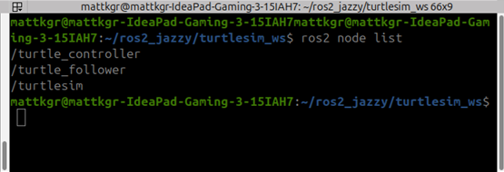
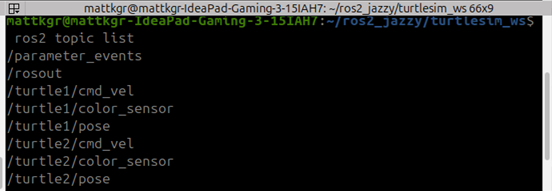
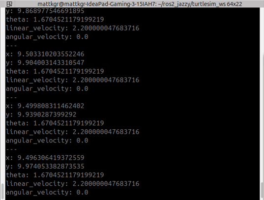
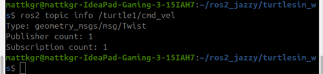
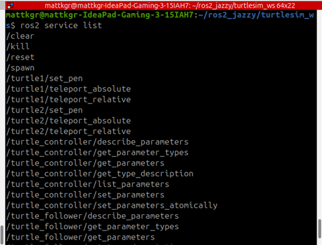
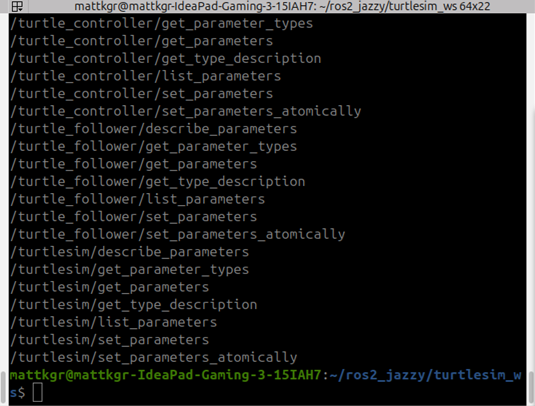
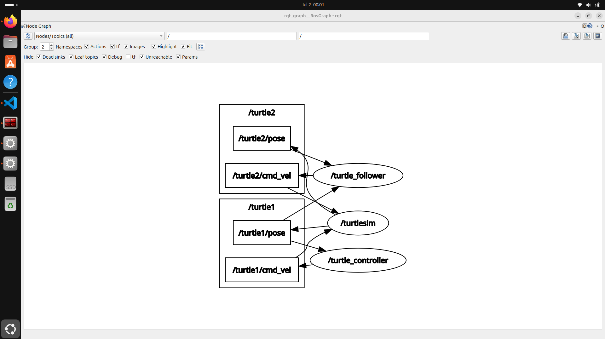
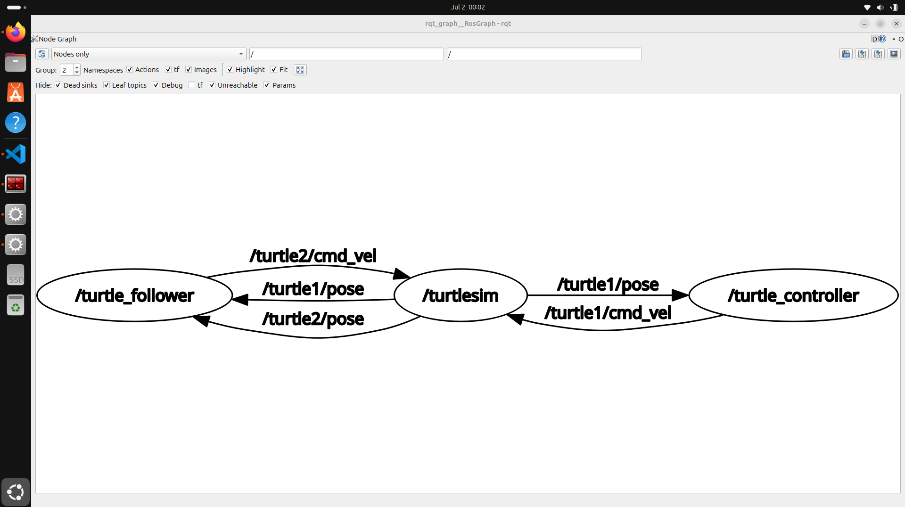

<picture>
    <source srcset="https://imgur.com/5bYAzsb.png" media="(prefers-color-scheme: dark)">
    <source srcset="https://imgur.com/Os03JoE.png" media="(prefers-color-scheme: light)">
    
</picture>

<h3>Curso de Robótica 2026-I</h3>

<h1>Informe Laboratorio #4</h1>

<h2>Profesores:  Pedro Fabián Cárdenas Herrera   Manuel Felipe Carranza Montenegro </h2>

# Integrantes
1. Juan Andrés Moreno Benavides [jumorenobe@unal.co](Jumorenobe)
2. Mateo Ramos Cujer [mramoscu@unal.edu.co](MateoKGR)

# Índice

- [1. Descripción General](#1-descripción-general)
- [2. Arquitectura de ROS 2 (Nodos, Tópicos y Servicios)](#2-arquitectura-de-ros-2-nodos-tópicos-y-servicios)
- [3. Control Manual de la Tortuga)](#3-control-manual-de-la-tortuga)
- [4. Funciones Automáticas y Trazado de Iniciales](#4-funciones-automáticas-y-trazado-de-iniciales)
- [5. Sistema Líder-Seguidor](#5-sistema-líder-seguidor)
- [6. Diagrama de Flujo del Sistema](#6-diagrama-de-flujo-del-sistema)
- [7. Verificación de la Arquitectura (Comandos de Inspección)](#7-verificación-de-la-arquitectura-comandos-de-inspección)
- [8. Evidencias de Funcionamiento](#8-evidencias-de-funcionamiento)
- [9. Video Explicativo y Conclusiones](#9-video-explicativo-y-conclusiones)

---

## 1. Descripción General

Este laboratorio práctico consiste en el diseño, desarrollo e implementación de un sistema de control robótico multiagente utilizando **ROS 2 Jazzy Jalisco** sobre el sistema operativo **Ubuntu 24.04 LTS**. El proyecto explora los fundamentos de la comunicación distribuida en robótica mediante el simulador bidimensional `turtlesim`.

El núcleo del desarrollo se divide en tres hitos principales:
* **Teleoperación de bajo nivel:** Creación de un sistema de lectura directa del teclado en bruto (*raw mode*) sin depender de herramientas estándar como `turtle_teleop_key`, garantizando un control asíncrono y libre de bloqueos.
* **Control cinemático y navegación por puntos (Waypoints):** Implementación de una estrategia híbrida que combina el control por tiempo para figuras geométricas regulares (cuadrado y triángulo) y un control en bucle cerrado basado en coordenadas absolutas para el trazado de iniciales personalizadas de alta precisión.
* **Comportamiento Multiagente (Líder-Seguidor):** Desarrollo de un controlador descentralizado donde un robot seguidor (`turtle2`) procesa la telemetría en tiempo real de un robot líder (`turtle1`) para realizar una aproximación progresiva y suave mediante un controlador proporcional, respetando distancias críticas de seguridad.

## 2. Arquitectura de ROS 2 (Nodos, Tópicos y Servicios)

La arquitectura de este sistema es distribuida y desacoplada, compuesta por tres nodos principales que se comunican de manera asíncrona mediante el paso de mensajes (tópicos) y la ejecución de tareas específicas bajo demanda (servicios).

### A. Elementos Centrales de la Arquitectura
* **Nodos:**
  * `/turtlesim`: El nodo del simulador gráfico que renderiza la interfaz y procesa físicamente la cinemática de los robots.
  * `/turtle_controller` (`move_turtle.py`): Nodo supervisor y líder. Captura el teclado, ejecuta las máquinas de estado para las trayectorias e iniciales de `turtle1`.
  * `/turtle_follower` (`follower_controller.py`): Nodo seguidor. Implementa el lazo de control proporcional para que `turtle2` persiga dinámicamente al líder.
* **Tópicos:**
  * `/turtle1/cmd_vel` y `/turtle2/cmd_vel` (`geometry_msgs/msg/Twist`): Canales donde se publican las velocidades lineales y angulares.
  * `/turtle1/pose` y `/turtle2/pose` (`turtlesim/msg/Pose`): Canales de telemetría que transmiten la posición $(x, y, \theta)$ de cada tortuga.
  * `/turtle1/color_sensor` y `/turtle2/color_sensor` (`turtlesim/msg/Color`): Canales nativos del simulador que publican constantemente los valores RGB del lienzo justo debajo de cada tortuga. Aunque no se emplean activamente en el algoritmo de seguimiento, son parte inherente de la arquitectura del nodo `turtlesim`.
* **Servicios:**
  * `/spawn` (`turtlesim/srv/Spawn`): Usado de forma autónoma por el seguidor para instanciar a `turtle2`.
  * `/reset` (`std_srvs/srv/Empty`): Resetea el lienzo a su estado inicial.
  * `/turtle1/set_pen` (`turtlesim/srv/SetPen`): Controla el estado del trazo del líder.

---

### B. Inspección y Verificación de la Arquitectura en Consola

A continuación, se presentan los comandos de diagnóstico ejecutados en ROS 2 Jazzy Jalisco para auditar el comportamiento del ecosistema en tiempo real:

#### 1. Verificación de Nodos Activos (`ros2 node list`)
Este comando interroga al *Graph de ROS 2* para listar todos los procesos de software independientes que se están ejecutando y comunicando entre sí. Permite comprobar que tanto el líder, el seguidor y el simulador se encuentran vivos de forma simultánea.

#### 2. Auditoría de Canales de Comunicación (`ros2 topic list`)
Muestra todos los tópicos registrados en el sistema. Es fundamental para verificar que los canales de telemetría (`pose`) y comandos de velocidad (`cmd_vel`) de ambas tortugas fueron creados correctamente por la infraestructura de ROS 2.

#### 3. Monitorización de Telemetría en Tiempo Real (`ros2 topic echo /turtle1/pose`)
Vuelca en la terminal el flujo continuo de datos de un tópico. Permite certificar matemáticamente que el nodo líder está publicando sus coordenadas bidimensionales de forma ininterrumpida y con total precisión posicional.

#### 4. Análisis de Metadatos del Canal (`ros2 topic info /turtle1/cmd_vel`)
Nos detalla el tipo exacto de estructura de datos (`geometry_msgs/msg/Twist`) que viaja por el canal, así como el conteo de nodos suscritos y publicadores conectados. Permite comprobar que el nodo move_turtle actúa exitosamente como publicador único de dicho canal.

#### 5. Catálogo de Servicios Disponibles (`ros2 service list`)
Lista los servicios síncronos activos. Permite verificar la existencia de los puntos de acceso indispensables (`/spawn, /reset, /set_pen`) mediante los cuales nuestros nodos interactúan directamente con la configuración interna del simulador.

#### 6. Mapeo Gráfico de la Infraestructura (`rqt_graph`)
Herramienta analítica visual indispensable que grafica de manera interactiva la topología de la red actual. Para lograr una comprensión profunda de la arquitectura implementada, se realizó el análisis bajo dos filtros de visualización distintos:

Vista 1: Nodos y Tópicos Completos (`Nodes/Topics all`)
Esta visualización evidencia los espacios de nombres (rectángulos indicando el namespace `/turtle1 y /turtle2`) y los tópicos que habitan dentro de ellos. Se observa claramente el puente de datos: cómo el nodo `/turtle_follower` (derecha) extrae información de los tópicos `/turtle1/pose` y `/turtle2/pose`, calcula la trayectoria, y envía las órdenes correspondientes al tópico `/turtle2/cmd_vel`.

Vista 2: Dependencia Directa entre Nodos (`Nodes only`)
Al aplicar este filtro, rqt_graph oculta los tópicos para mostrar estrictamente cómo los procesos de software interactúan entre sí. Esta gráfica valida de forma contundente la directriz del laboratorio: El controlador envía datos al simulador (/turtle_controller $\rightarrow$ /turtlesim), y a su vez, el simulador alimenta de posiciones al seguidor para que este retroalimente el ciclo enviando nuevas velocidades al simulador (/turtlesim $\leftrightarrow$ /turtle_follower).

