<div align="center">
<picture>
    <source srcset="https://imgur.com/5bYAzsb.png" media="(prefers-color-scheme: dark)">
    <source srcset="https://imgur.com/Os03JoE.png" media="(prefers-color-scheme: light)">
    
</picture>

<h3>Curso de Robótica 2026-I</h3>

<h1>Informe Laboratorio #5</h1>

<h2>Profesores: <br>Pedro Fabián Cárdenas Herrera <br> Manuel Felipe Carranza Montenegro<br></h2>

</div>

# Integrantes
1. Juan Andrés Moreno Benavides [jumorenobe@unal.co](Jumorenobe)
2. Mateo Ramos Cujer [mramoscu@unal.edu.co](MateoKGR)


# Índice

1. [Descripción detallada de la solución planteada](#Descripción-detallada-de-la-solución-planteada)
2. [Diagrama de flujo de las acciones del robot](#Diagrama-de-flujo-de-las-acciones-del-robot)
3. [Código fuente](#Código-fuente)
4. [Plano de planta](#Plano-de-planta)
5. [Diagramas digitales y DH utilizado](#Diagramas-digitales-y-DH-utilizado)
6. [Calibración, Graficas de interpolación y trayectoria sinusoidal](#Calibración,-Graficas-de-interpolación-y-trayectoria-sinusoidal)
7. [Videos](#videos)
8. [Conclusiones individuales.](#Conclusiones individuales.)


## Descripción detallada de la solución planteada
Se desarrolló un nodo de ROS 2 en Python que permite:

Comunicación directa con los motores Dynamixel mediante puerto serial.
Control individual y conjunto de cada articulación del manipulador.
Publicación del mensaje `/joint_states` para animación del modelo en RViz.
Implementación de una interfaz gráfica con control articular, visualización en RViz y aplicacion de los diferentes modos pedidos en el laboratorio .

La arquitectura del sistema integra tres componentes principales:
1. Nodo ROS 2 de control de motores.
2. Interfaz gráfica (GUI) en Tkinter.
3. Modelo del robot visualizado en RViz.

### Funciones utilizadas

Se presentan a continuación las funciones utilizadas en la interfaz gráfica tanto en todos los modos como en modos específicos

---
### Todos los modos

* **Movimiento Simultáneo:** Todas las articulaciones se mueven simultáneamente a la posición enviada.
* **Movimiento Secuencial:** Todas las articulaciones se mueven en orden a la posición enviada (Base-Hombro-Codo-Muñeca-Pinza).
* **Velocidad Por Ingreso Numérico:** Permite ingresar directamente valores de velocidad para todos los motores y enviarlas al sistema.
* **Home:** Manda al robot a Home.
* **Torque On / Torque Off:** Energiza y desenergiza los motores.
* **Parada De Software:** Desenergiza el sistema de inmediato por software (Recomendable no confiarse totalmente y tener la mano cerca al botón de energía de la multitoma).
* **Estado:** Muestra el estado del robot y qué instrucción se encuentra realizando.
* **Visualización en RViz:** Se sincroniza el robot físico con el modelo virtual del PhantomX Pincher X100 usando `robot_state_publisher`.

---

### Modo Manual

* **Control articular por ingreso numérico:** Permite ingresar directamente valores de posición para cada articulación en un rango seguro y enviarlas al sistema.

---
### Modo Presets 

**Se presentan el envio por botones de diferentes poses predefinidas al robot presentadas en el laboratorio**
                   
                                | Articulación |  Pose 1  |  Pose 2  |  Pose 3  |  Pose 4  |  Pose 5  |
                                | ------------ | -------- | -------- | -------- | -------- | -------- | 
                                |      1       |    00    |    25    |   −35    |    85    |    80    |
                                |      2       |    00    |    25    |    35    |   −20    |   −35    |
                                |      3       |    00    |    20    |   −30    |    55    |    55    |
                                |      4       |    00    |   -20    |    30    |    25    |   −45    |
                                |      5       |    00    |    00    |    00    |    00    |    00    |

<h4>Los primeros cuatro valores corresponden al brazo y el quinto corresponde a la pinza. </h4>

---
### Modo Trayectoria

**Genera una trayectoria entre dos configuraciones alejadas y compara la suavidad de la imterpolación lineal frente a la cubica / quintica**

* **Pose Inicial:** Ingresar directamente de que posición ya preestablecidad o actual va a iniciar el robot .
* **Pose Final:** Ingresar directamente a cual posición ya preestablecidad va a ir el robot .
* **Articulación a graficar:** Selecionar cual recorrido de las 5 articulaciones se va a graficar .
* **Duración:** Duración en segundos de la grafica .
* **Muestras:** Cuantas Muestras se van a tomar para la interpolación .
* **Interpolaciòn:** Seleccionar el tipo de interpolación (Lineal,Cúbica,Quintica) .
* **Enviar Trayectoria:** Envia la trayectoria que se le indico al robot.
* **Graficar Trayectoria:** Grafica la trayectoria en posición angular vs tiempo con su respectiva interpolación lineal vs cubica/Quintica.
* **Grafica Trayectoria:** Muestra la Grafica.

---
### Modo Senoidal

**Selecciona una articulación y le da los parametros con  $q(t) = q_0 + A \sin(2\pi f t)$**


* **Articulación:** Ingresar a cual articulaciòn se le va aplicar la función .
* **Q0:**  Ingresar numericamente el centro de la función.
* **Amplitud A1/A2** Ingresar numericamente las amplitudes de las funciones.
* **Frecuencia F1/F2** Ingresar numericamente las Frecuencias de las funciones.
* **Articulación a graficar:** Selecionar cual recorrido de las 5 articulaciones se va a graficar .
* **Duración:** Duración en segundos de la grafica .
* **Ejecutar:** Ejecuta las 4 pruebas .
* **Ver Prueba:** Ve la prueba seleccionada .
* **Error:** Muestra un error si este se ha presentado.
* **Posición enviada vs Posición medida:** Grafica de la operación.

---
### Modo Enseñanza

**Registra poses con su respectivo nombre de acuerdo a la posición del robot en el espacio gracias al modo manual, guarda el registro de loas poses en un yaml, las reproduce en orden con el tiempo de transición que se desea al igual que reproducir la que el usuario quiera**


* **Nombre de la pose:** Ingresar por teclado el nombre de la pose actual .
* **Guardar:** Guarda la pose actual con su respectivo nombre.
* **Poses Registradas:** Lista de poses en orden de creación con sus parametros.
* **Ir a la Pose seleccionada:** Envia la pose seleccionada al robot .
* **Eliminar Pose seleccionada:**  Elimina la pose seleccionada de la lista .
* **Guardar yaml:** Guarda el archivo yaml en /home/juan-moreno/pincher_taught_poses.yaml .
* **Recargar yaml:** Elimina variables nuevas y va al ultimo archivo yaml creado.
* **Tiempo de transición :** Tiempo de segundos entre poses cuando se repodruzcan en orden .
* **Reproducir Todas:** Reproduce las poses de la lista en el tiempo preestablecio.
* **Detener:** Detiene la reproducción de las poses.

---

### Modo Triangulo

**Ejecuta una secuencia de poses para el desarrollo de un triangulo previamente encontradas gracias a cinematica inversa (Tres vertices) e interpolación lineal, se utilizan 60 muestras totalmente editables para quitar o agregar mas en la constante Triangle_Poses**


* **Secuencia:** Lista de poses de Triangle_Poses con sus respectivos parametros .
* **ejecutar:** Ejecuta la secuencia de Triangulo.
* **Detener:** Detiene la secuencia de triangulo.

---

### Modo Baile

**Ejecuta una coreografia de poses definidas, cada pose tiene su propio retardo y reprodruce automaticamente la canción "Chipi chipi" al inicio de la coreografia**


* **Coreografia:** Lista de poses de la coreografia con sus respectivos parametros .
* **ejecutar:** Ejecuta la coreografia y la musica.
* **Detener:** Detiene la coreografia y la musica.

---

## Diagrama de flujo de las acciones del robot

El siguiente diagrama detalla la interacción exhaustiva entre la interfaz gráfica de usuario (`PincherGui`), el nodo de ROS 2 (`PincherGuiNode`) y el controlador de hardware.


```md
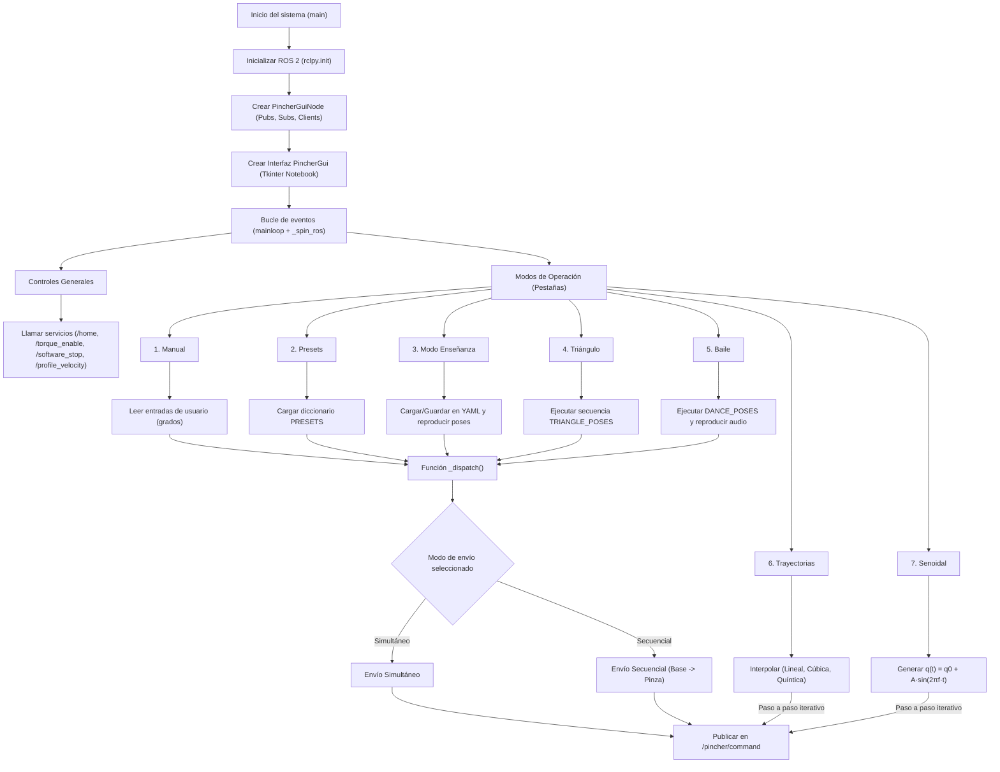

## Código fuente

Esta sección describe el código de la iterfaz grafica desarrollada para el laboratorio 

El archivo que contiene el código completo del sistema es:

```text
code/pincher_gui.py
```
1. Importación de librerías
```
import rclpy
from rclpy.node import Node
from dynamixel_sdk import PortHandler, PacketHandler
import tkinter as tk
from tkinter import ttk, messagebox
import threading
import subprocess
import math
import numpy as np
```
Estas librerías permiten la creación del nodo ROS 2, la comunicación con los motores Dynamixel, la construcción de la interfaz gráfica de usuario, la ejecución de RViz y la realización de los cálculos matemáticos necesarios para la cinemática directa.

2. Selección del tipo de motor Dynamixel
```
USE_XL430 = False
```
Esta variable define el modelo de motor Dynamixel utilizado. Dependiendo de su valor, el código adapta automáticamente el protocolo de comunicación, las direcciones de memoria y los rangos de operación.

3. Funciones auxiliares de comunicación

```
def write_goal_position(packet, port, dxl_id, position):
def write_moving_speed(packet, port, dxl_id, speed):
def read_present_position(packet, port, dxl_id):
```
Estas funciones encapsulan la lectura y escritura de registros en los motores Dynamixel. Su objetivo es abstraer las diferencias entre protocolos y simplificar el envío de comandos a los actuadores.

4. Nodo ROS 2 – PincherController
```
class PincherController(Node):
```
Esta clase define el nodo principal del sistema. Se encarga de inicializar la comunicación serial con los motores, configurar los parámetros operativos, publicar los estados articulares, calcular la cinemática directa y gestionar la parada de emergencia.

5. Parámetros ROS configurables
```
self.declare_parameter('port', '/dev/ttyUSB0')
self.declare_parameter('baudrate', 1000000)
self.declare_parameter('dxl_ids', [1, 2, 3, 4, 5])
```
Estos parámetros permiten modificar la configuración del sistema sin necesidad de alterar el código fuente, utilizando el sistema de parámetros de ROS 2.

6. Publicación de estados articulares
```
self.joint_state_pub = self.create_publisher(
    JointState, '/joint_states', 10)
```
El nodo publica periódicamente el estado de las articulaciones en el tópico /joint_states, lo que permite sincronizar el robot físico con su modelo virtual en RViz.

7. Conversión entre valores Dynamixel y radianes
```
def dxl_to_radians(self, dxl_value):
def radians_to_dxl(self, radians):
```
Estas funciones convierten los valores de posición de los motores Dynamixel a radianes y viceversa, facilitando los cálculos cinemáticos y la correcta visualización del estado del robot.

8. Cálculo de la cinemática directa
```
def dh_transform(self, a, alpha, d, theta):
```
Esta función calcula la matriz de transformación homogénea utilizando los parámetros Denavit–Hartenberg para cada articulación del robot.
```
def update_tcp_position(self):
```
A partir de la matriz homogénea total se obtienen las coordenadas cartesianas X, Y y Z del TCP, las cuales se muestran en tiempo real en la interfaz gráfica.

9. Interfaz gráfica de usuario (GUI)
```
class PincherGUI:
```
La interfaz gráfica fue desarrollada utilizando Tkinter y organizada en varias pestañas que permiten los diferntes modos presentados anteriormente.

10. Integración con RViz
```
ros2 launch phantomx_pincher_description display.launch.py
```
Desde la interfaz gráfica es posible ejecutar RViz y visualizar el modelo tridimensional del manipulador sincronizado con el robot real.

11. Parada de emergencia
```
def emergency_stop(self):
```
La parada de emergencia desactiva el torque de todos los motores y bloquea el envío de nuevos comandos, garantizando la seguridad del sistema y del usuario.

Aclaraciones importantes
```

def r2_all_motors(self, list_q):

    # Convertir radianes a Dynmixel
        point_q = [self.radians_to_dxl(q) for q in list_q]

    # Enviar cada posición al motor correspondiente
        for index, motor_id in enumerate(self.dxl_ids):
            if motor_id == 5:      # no mover la pinza
                break

            self.move_motor(motor_id, point_q[index])
```

## Plano de planta
A continuación se muestra el plano de planta

<p align="center">
  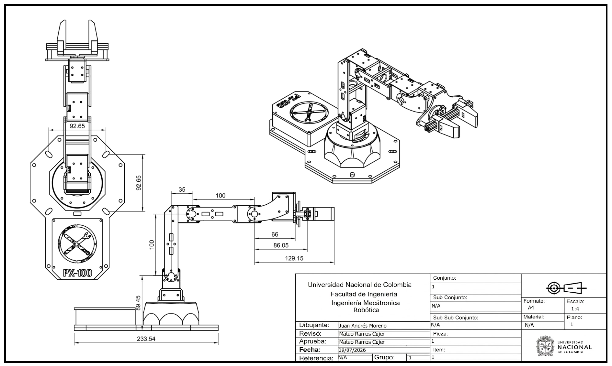
</p>


## Diagramas digitales y DH utilizado

<svg width="44" height="44" viewBox="0 0 44 44" fill="none" xmlns="http://www.w3.org/2000/svg" xmlns:xlink="http://www.w3.org/1999/xlink">
<rect width="44" height="44" rx="16" fill="url(#paint0_linear_107_117)"/>
<g clip-path="url(#clip0_107_117)">
<g clip-path="url(#clip1_107_117)">
<g clip-path="url(#clip2_107_117)">
<mask id="mask0_107_117" style="mask-type:luminance" maskUnits="userSpaceOnUse" x="8" y="8" width="28" height="28">
<path d="M36 8H8V36H36V8Z" fill="white"/>
</mask>
<g mask="url(#mask0_107_117)">
<g opacity="0.9">
<mask id="mask1_107_117" style="mask-type:luminance" maskUnits="userSpaceOnUse" x="8" y="8" width="28" height="28">
<path d="M36 8H8V36H36V8Z" fill="white"/>
</mask>
<g mask="url(#mask1_107_117)">
<mask id="mask2_107_117" style="mask-type:luminance" maskUnits="userSpaceOnUse" x="8" y="8" width="28" height="28">
<path d="M36 8H8V36H36V8Z" fill="white"/>
</mask>
<g mask="url(#mask2_107_117)">
<path d="M35.7634 8H8V35.7634H35.7634V8Z" fill="url(#pattern0_107_117)"/>
</g>
</g>
</g>
</g>
</g>
</g>
</g>
<defs>
<pattern id="pattern0_107_117" patternContentUnits="objectBoundingBox" width="1" height="1">
<use xlink:href="#image0_107_117" transform="scale(0.01)"/>
</pattern>
<linearGradient id="paint0_linear_107_117" x1="0" y1="0" x2="44" y2="44" gradientUnits="userSpaceOnUse">
<stop stop-color="#F6B640"/>
<stop offset="1" stop-color="#F6B63D"/>
</linearGradient>
<clipPath id="clip0_107_117">
<rect width="28" height="28" fill="white" transform="translate(8 8)"/>
</clipPath>
<clipPath id="clip1_107_117">
<rect width="28" height="28" fill="white" transform="translate(8 8)"/>
</clipPath>
<clipPath id="clip2_107_117">
<rect width="28" height="28" fill="white" transform="translate(8 8)"/>
</clipPath>
<image id="image0_107_117" width="100" height="100" preserveAspectRatio="none" xlink:href="data:image/png;base64,iVBORw0KGgoAAAANSUhEUgAAAGQAAABkCAYAAABw4pVUAAAACXBIWXMAAAsTAAALEwEAmpwYAAAAAXNSR0IArs4c6QAAAARnQU1BAACxjwv8YQUAAAhHSURBVHgB7Z1LjBzFGcf/Vd0zs+/Mrh1jG1ivE0MUHmLtPBSFg8eKEglHjuREUS6R7EOuxE44ImHvATh6kRASByRzAQ4gJCwMBxBjgcQJMG9YjD0YAzbg3bFnH/PqKr7qfWh7ZteuWXd39c7UTxqPp+eb2d36z1ffo6p7GNZI6UQu57rYLSVG6eGoBLKMbuhA6G8vMokCYygKiVNCIN+/L5/HGmCtGE+9khvJSByiX+Bgpw5+CxQkQ75axtjg/nxB90Vagigh0sAR+hQchKVlSJjjusJcV5DZV3OHpMBR6xE3TJFuYz178+PXMlpVkKkXc9l0F45ZrwidcRLlf6s9uaIgSoxMGm/Qs6OwhI/E6UoVe2gKKzY+xVeyt2JEDI2tGmP1wW98qkmQ2ZO5Y1aMGKAxTqdxrPFwQBAVwOnuMCyxQHXLQXKAwHgvxRA/tZV4z2ZTsVOsVLBzMSVe8hC/zrBimEBls0cWH/geslCBn4PFGOQl25WX+B6ivAMWo6TS87HbF4SKvxwsRuEMB9Q9U11bx6G6w2Icz8Mezrn1jqSgtODkKrthSQYco5wWVGyqmxAolt/DKfEdgSUpZLktBhNF1kUb4tz8F/DeYf//sjKJ+tcnAFFrMOqGc+t94Okh/6G4MgHv+7foBQImaTtB3JG/I/Xr+wPH5MxX8H58J3AsdfcDcLf8aZmRh/KbB8j2G5iEo81wNt3bcERClC832w3tDFrVrgK1aZimvQRhLlj2jsAhWaWBnrsUNOu+CSwzGLQrfTUvimEin7IYS5HsDmKh91YwpytwSM5cUP8GjvONv0Pj6rW4+jkYzwRfK6qxxxRGCyQSEcF6tiC962Gw9ADigmU2BB5LFcwbP/kU0JnbE7Srl6l3MRO086qQcxdRv/QWxKU8ZHkSUROdIE4GmT88Dj6wA+2AnL2I2sRT8L57DVESTQwhMdKjD7WNGArWs5n+pgeR2nEAURKJIKnb/0PZzh/Rjri3HYQz8k9EReiCqKLM3fYPtDOpHf9uikFhEaogPHsnUnf9399O0c6w1ACcbfsRBaEJwjIbkdo11pQ6tiuOnzqHTyiCsFQ/Mr99BLwh5WxnVHGpCtGwCeUdWdcm1M+/hHUHTa2seyucLTm639zSSz2kUEeaBrCOMAlFEFH60r+tV+pnn4N753/hbt6jHf8kVW8eFfFuyOGy7ZqLa0HWrqD2/iMQxU9hGivIItR+9y68DNMYXw9h1BDk/du1bGXlMsTUx4iKyuQERQazGBckRVWvM7xPy7ZeeCFSQTzhwTSGpyzKcgbv0LYW0+2//dioICzVR027W7Tt5eT7aHfMCtI7TAtHepW9rE9DzJpd744Do4Lwwbu0bWXp7HzyHyFd3f0wjVlBfvYrbVsvhhrB2fR7mMacIDwN3rNV21xGmF0plLc6w3+DaYylvTwzCNY3omcsBWR1ym9ihg4lFnzDLqTVXi7HfKfamCD+dh3dAaD+kloSDv+XYP7ahvLWVuFMIq0204S8KcWch2T16w+/Xun6OZIEq5fA5BzCxlgM0W2XJBV5dSKSrM+IIK0WhEmkfuEkosCMILQYlLQpqBXE5Xepp/YJosCMICq7Yuuz86+yveoHj6rWAaLAyKi0UqEnCdUtqLx9P2T5R0SFkSzLyepX6MahwC2ph+ZdPIXaF8cj84xF4heEUfLeM6xtrjZPyGrwOl/OTfdSlvbLwDHv29ebmo/uLXspVm0Mvl/heRrTWWhRm4EonZlfgxEVxEHsgvD+X+jv+qvPoP75k00D6Gz8TdCOKvn62Wdo8M4uHVI/w93656AZvV/tsycib1LeCLHHEL5hp7atmPm6+dOsquveoIfJuUs0r/8QNFOZnNo7tdxu+nyixVDEL8iQ/sXqxNSHTcdU/dLY0xLTBchaqcHu5qZMThSjbVCGQfyC6DYUMX9mbBO1afKI7+eDK93k7Lc0XT3bZKbSU1+kBTtx9Qzq555D0ok1hqhPtjrPQgvpLZyO1nCYBrqc/9d1Xy6mPkL5NfPt9FaJ1UP4BjVdae4MrEySIOfRacQqCOvXP6NKXPlMPz1tI+L1kIHbtG3F5AfoROIThDIePnS3tvlK8aMTiE0Qvy5w+7RsJWVSogPjhyI2QXif/oKUKvLU+eGdSHyCDLWwB4sKPdNX5TFFfIIM6Hd4RfFDdCqxCMLcXlqU0u/wiuIEOpV4BCExWHpQ05rWHzpgl/tqxCIIH7hde8lWls51ZEG4SDyCDN2jbeutg45slEQviCoI+7ZpmysP6WQiF0Sdw44WzgFfaQ2kk4hcEOUdzO3WsvUrdOsh0SJoAUmtZWvZqvghzZ94aZJIL/G3BPWwtC5dUbvStDbeacSzYlinZdfSGViuj72SQ8KwgiQMK0jC4HL+W4wtyaCovq7CCpIcCmrKOg1LIlDOwaVE+19AZJ0gJE5xIZCHJREoLfxthDMnc1P2q4+MU+jZm9/up700bT0Ni1EYm5+pfEEcjnFYzFLGmLrzBem+L1+gesR6iSHIO453N36fOhUkR22RGD/+mC94h2JJEOUlFNjHYIkVNeaL3rHwOMj0ydxxUinaby2x+FDd8VjfX/OHlx9rai7WKjhMWZet3qOGxrhRDEWTIIP788VqFXusKBFCY9tNY7zSU9c8v2z65dw4BftDsISGoGy2l2YhRh/8lZ6/7gl/tOZ+mDKBI7aSvzFUNqUCOFXj16z5tM7AnHslN0IB6CizwX5NqDpDpbbLs6lVbdECy4TZTQ9HYFkV3yOoJcWqGNcRYpE1fx1J6UQuxzlyFGN2k0hZeqeRTp3WFqYjFRNOq+UM1bXt35fPYw38BH5QrjB6fvX1AAAAAElFTkSuQmCC"/>
</defs>
</svg>

La cinemática directa se implementó usando parámetros Denavit-Hartenberg medidos directamente del robot:

| i | θᵢ | dᵢ | aᵢ | αᵢ |
|---|----|----|----|----|
| 1 | q1 | L1 | 0  | -π/2 |
| 2 | q2 | 0  | L2 | 0 |
| 3 | q3 | 0  | L3 | 0 |
| 4 | q4 | 0  | 0  | π/2 |

A continuación los diagramas utilizados.

<p align="center">
  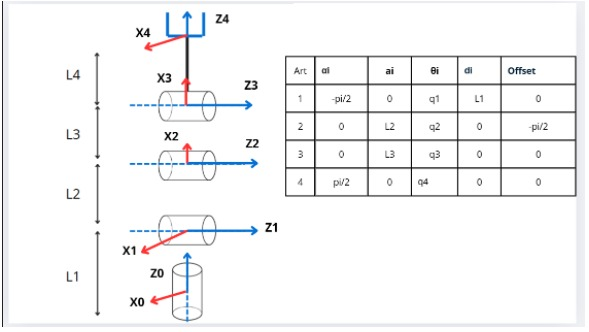
</p>


Visualización completa en MATLAB

<p align="center">
  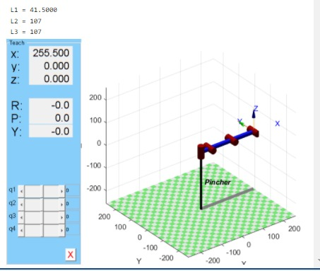
</p>

<p align="center">
  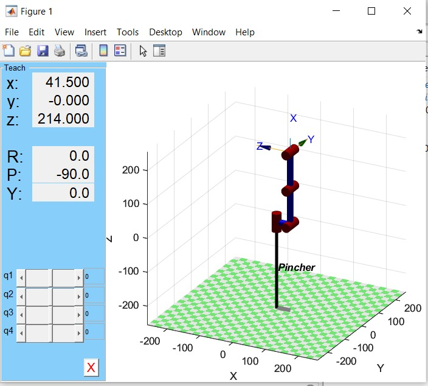
</p>
  


## Graficas digitales comparativas

| Articulación |  Pose 1  |  Pose 2  |  Pose 3  |  Pose 4  |  Pose 5  |
| ------------ | -------- | -------- | -------- | -------- | -------- | 
|      1       |    00    |    25    |   −35    |    85    |    80    |
|      2       |    00    |    25    |    35    |   −20    |   −35    |
|      3       |    00    |    20    |   −30    |    55    |    55    |
|      4       |    00    |   -20    |    30    |    25    |   −45    |
|      5       |    00    |    00    |    00    |    00    |    00    |

A continuación los diagramas digitales de las diferentes poses empezando por HOME :

<p align="center">
  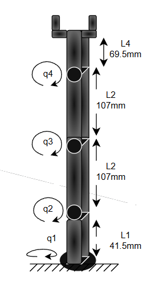
</p>

Poses r2 y r3, estas dos poses son equivalentes, solamente cambia q1.

<p align="center">
  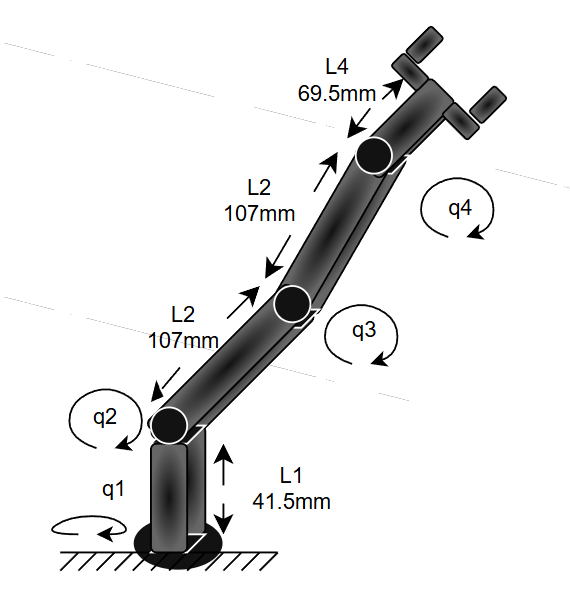
</p>


Continuamos con la pose R4:

<p align="center">
  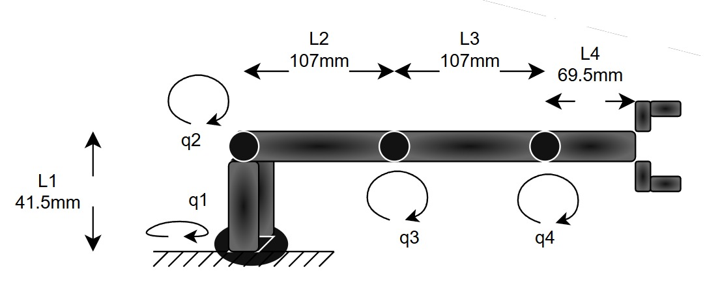
</p>


Poses implementadas Fisicamente:

HOME/ Pose 1:
<p align="center">
  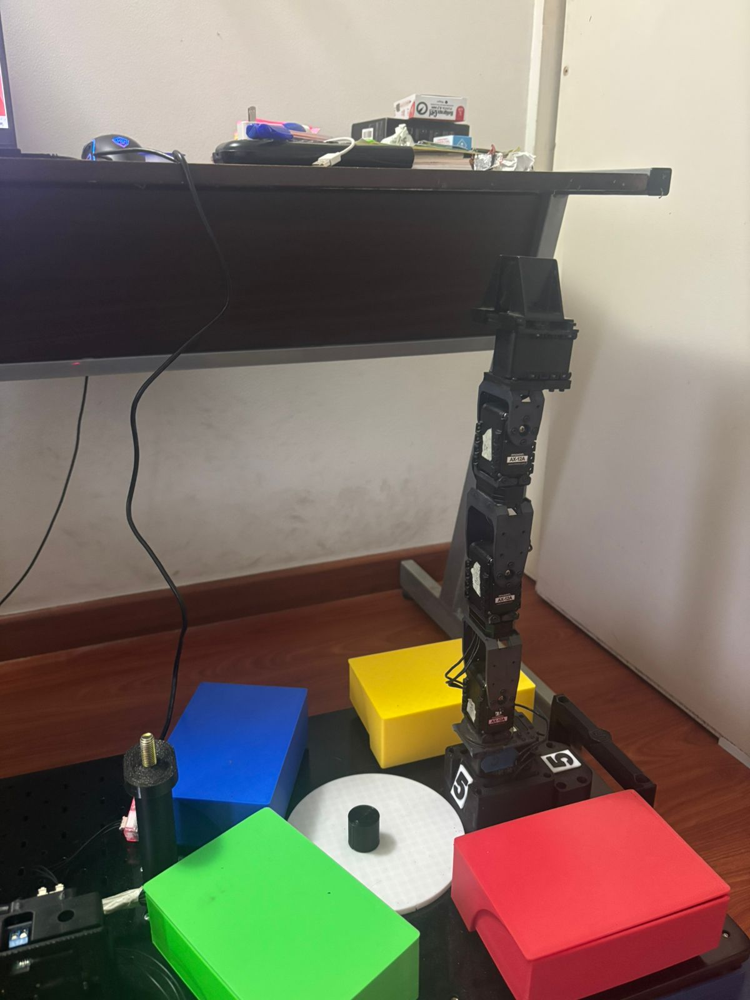
</p>
Pose 2:
<p align="center">
  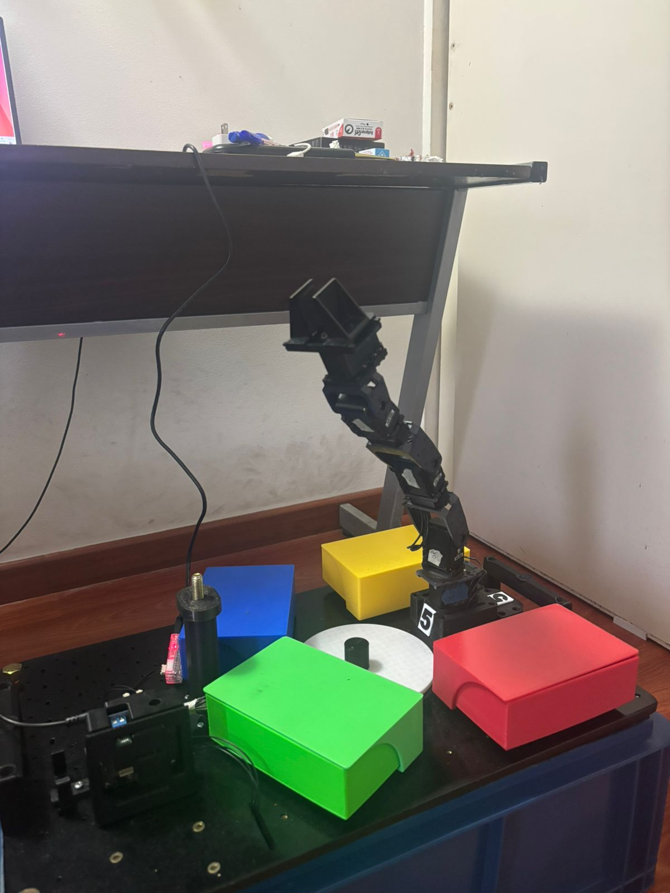
</p>
Pose 3:
<p align="center">
  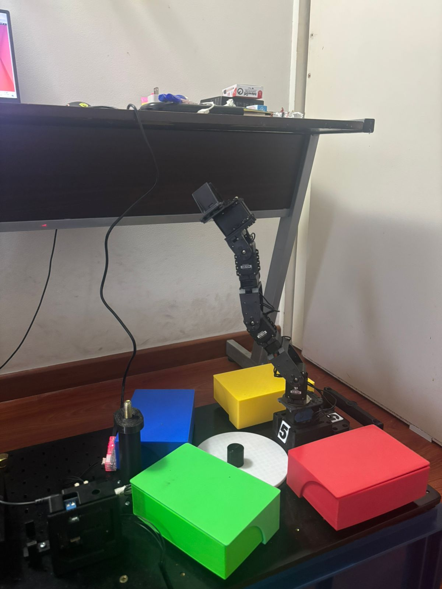
</p>
Pose 4:
<p align="center">
  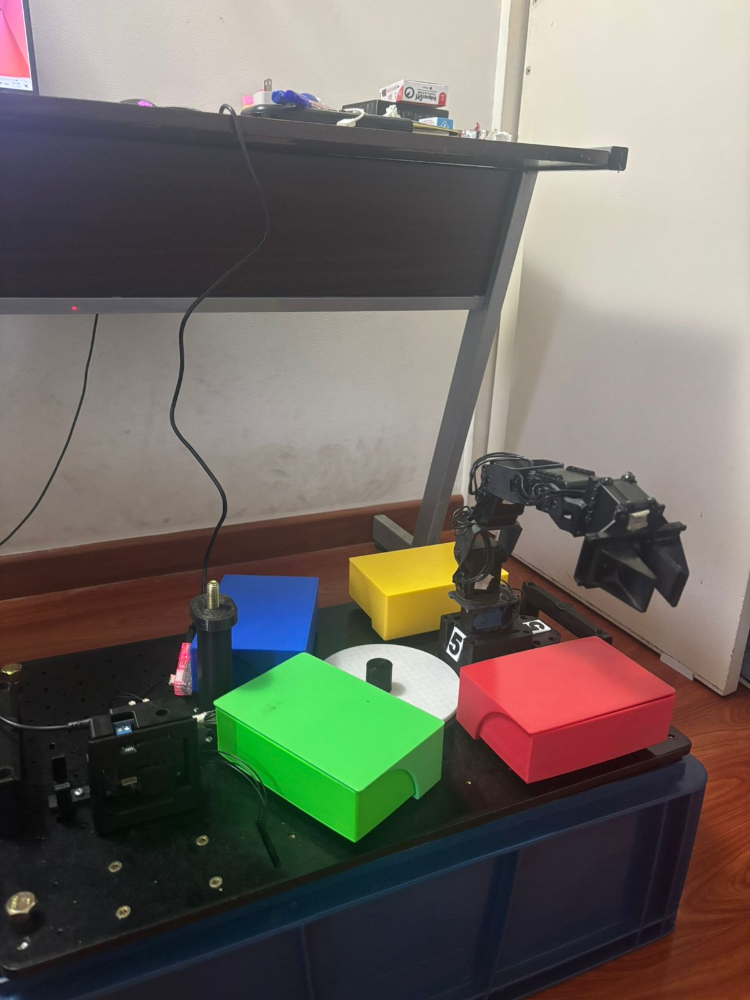
</p>
Pose 5:
<p align="center">
  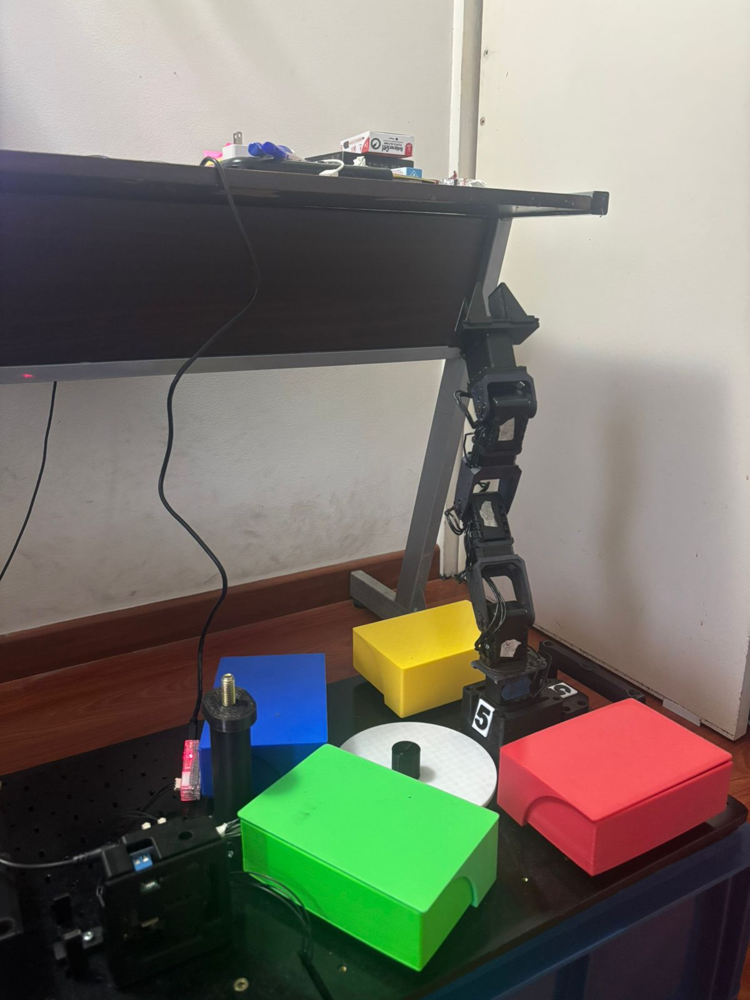
</p>

## Calibración, Graficas de interpolación y trayectoria sinusoidal

A continuación las imagenes de la posición real en las poses implementadas anteriormente con su respectivo error en cada  articulaciòn:

Error Pose 1/Home:
<p align="center">
  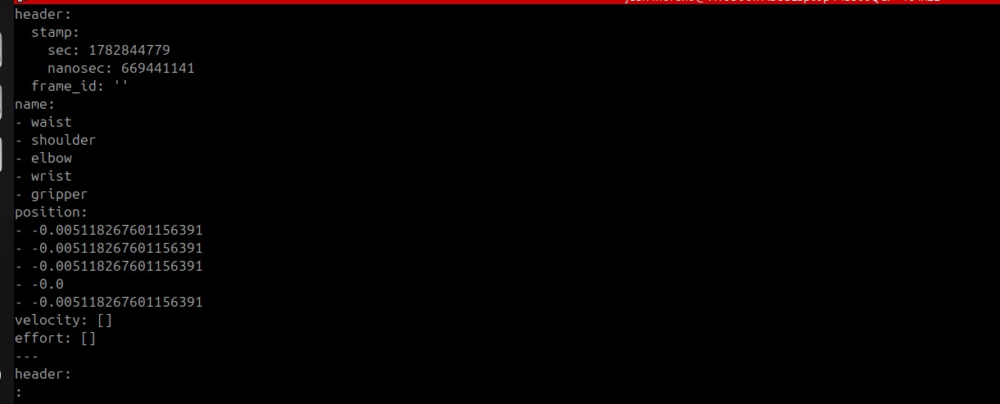
</p>
Error Pose 2:
<p align="center">
  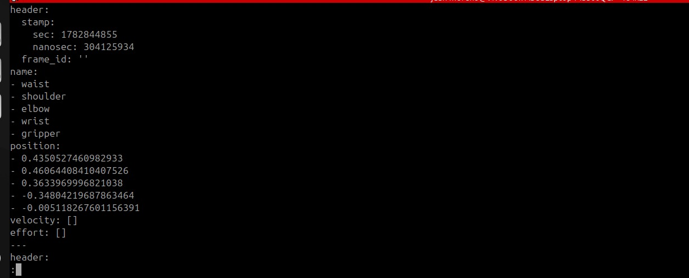
</p>
Error Pose 3:
<p align="center">
  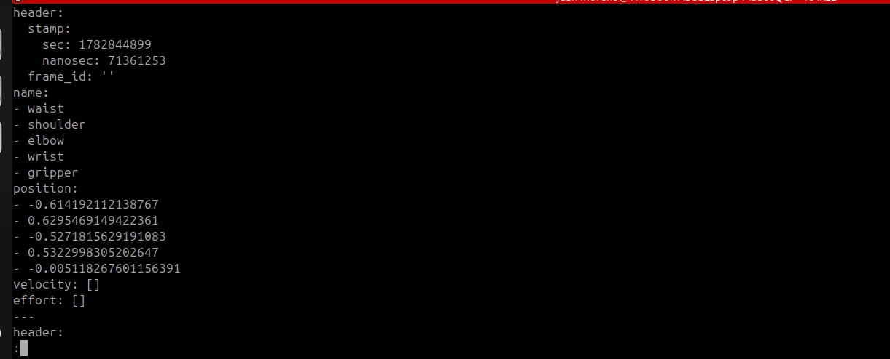
</p>
Error Pose 4:
<p align="center">
  
</p>
Error Pose 5 :
<p align="center">
  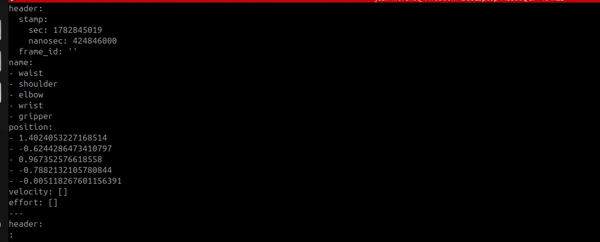
</p>


## Videos 
A continuación se presentan los videos implemnetando la interfaz con todos sus modos ademas del video con el baile


- [Video – Ejecución de poses del robot y demostración de la interfaz gráfica](https://drive.google.com/drive/folders/1bRAAmgxF9P8DvvkPTRfy_nz_58mMI_Yz?usp=sharing)


      

